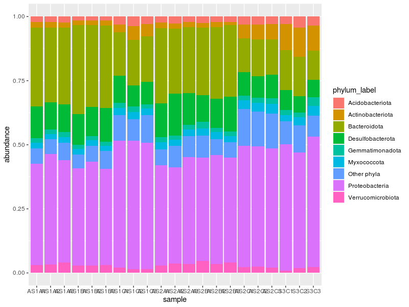
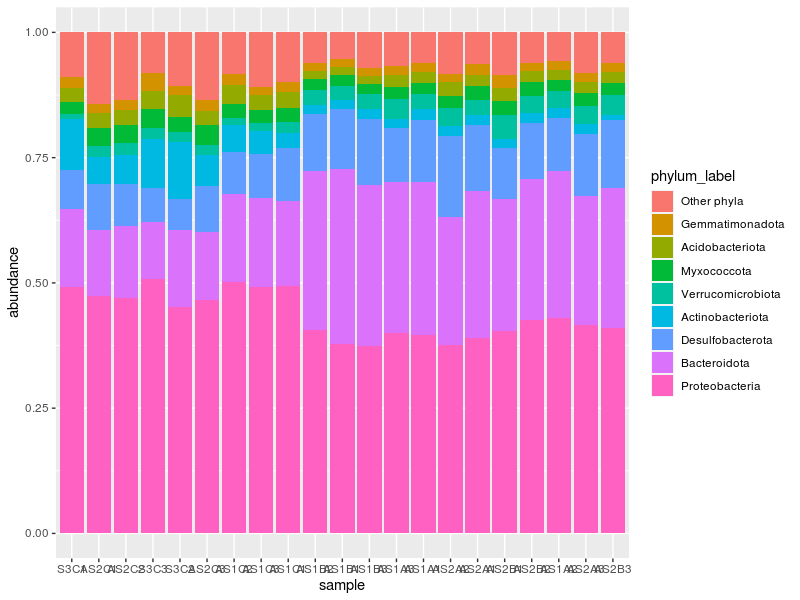
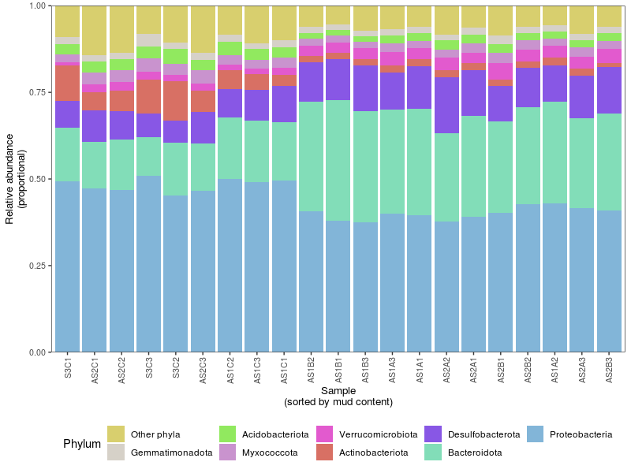

# Conditional statements, and manipulating strings and data frames.

Load libraries and import data.

!!! r-project "code"

    ```r
    library(readr)
    library(dplyr)
    library(stringr)
    
    asv <- read_tsv("tables/asv_table.tsv")
    taxa <- read_tsv("tables/taxonomy.tsv")
    env_data <- read_tsv("tables/env_table.tsv")
    ```

## Activity aims

* Create a taxonomy bar plot of relative abundances at Proteobacterial class level and phylum level for other phyla

## Conditional statements

Learning objectives:

* Understand the `if...else` construct
* Understand that conditions can be chained sequentially

The anatomy of the `if..else`:

```
if (expression) {

  do_something()

} else {

  do_something_else()

}
```

The `if...else` construct is a way of controlling output depending on a condition as evaluated using the expression inside the `(...)`. In other words, if the expression returns a `TRUE`, it will run the code within the first `{...}`, otherwise, it will run code in the second chunk `{...}`.

!!! r-project "code"

    ```r
    # Obtain total number of reads for a sample
    num_reads <- sum(asv$AS1A1)

    # Print output if the number of reads exceed 1000
    if (num_reads > 1000) {
      print("Exceeds 1000 reads")
    } else {
      print("Below 1000 reads")
    }
    ```

    !!! success "Output"

        ```
        [1] "Exceeds 1000 reads"
        ```

You can also omit the `else` part if you only want to do something if the condition is `TRUE`. The following statement will provide an output.

!!! r-project "code"

    ```r
    if (num_reads > 1000) {
      print("Exceeds 1000 reads")
    }
    ```

    !!! success "Output"

        ```
        [1] "Exceeds 1000 reads"
        ```

However, this one will not.

!!! r-project "code"

    ```r
    if (num_reads < 1000) {
      print("Below 1000 reads")
    }
    ```

You can also chain multiple conditions together to generate different outputs depending on the results of each evaluated condition.

!!! r-project "code"

    ```r
    num_reads <- sum(asv$AS1A2)

    if (num_reads > 5000) {
      print("High biomass")
    } else if (num_reads >= 1000 & num_reads < 5000) {
      print("Adequate biomass")
    } else if (num_reads < 1000) {
      print("Inadequate biomass")
    } else {
      print("Unknown")
    }
    ```

    !!! success "Output"

        ```
        [1] "Adequate biomass"
        ```

When chaining multiple conditions, be aware of the order of the conditions. This is because conditions are evaluated sequentially. For example:

!!! r-project "code"

    ```r
    if (num_reads > 1000) {
      print("Exceeds 1000 reads")
    } else if (num_reads >= 1000 & num_reads < 5000) {
      print("Adequate biomass")
    } else {
      print("Unknown")
    }
    ```

    !!! success "Output"

        ```
        [1] "Exceeds 1000 reads"
        ```

Note that both the first and second expressions are `TRUE`, but only the first code chunk ran. This can become important if you need to run different code depending on value ranges. Here, the priority of conditions is paramount to how you need to construct your `if...else` statements.

In `dplyr`, there is also a function called `if_else()`. This is a vectorised version of the conditional statement and returns a vector output if the expression is `TRUE` and another if `FALSE`. It can also deal with missing elements (unlike it's base R counterpart `ifelse()`).

```
if_else(expression, TRUE, FALSE, missing)
```

For example:

!!! r-project "code"

    ```r
    # Create a vector for the total number of reads for each sample
    total_reads <- colSums(asv[, -1])
    # Use vectorised if_else for evaluating each element
    if_else(total_reads > 1000, "Adequate biomass", "Insufficient biomass")
    ```

    !!! success "Output"

        ```
         [1] "Adequate biomass"     "Adequate biomass"     "Adequate biomass"     "Adequate biomass"    
         [5] "Adequate biomass"     "Adequate biomass"     "Adequate biomass"     "Adequate biomass"    
         [9] "Adequate biomass"     "Adequate biomass"     "Adequate biomass"     "Adequate biomass"    
        [13] "Adequate biomass"     "Adequate biomass"     "Adequate biomass"     "Adequate biomass"    
        [17] "Adequate biomass"     "Adequate biomass"     "Adequate biomass"     "Adequate biomass"    
        [21] "Insufficient biomass"
        ```

## String manipulation

Learning objectives:

* Detect patterns in strings
* Subset strings based on pattern
* Extract substrings based on pattern
* Replace substrings based on pattern
* Be aware of convenience functions

Knowing how to detect, subset, and replace strings is helpful for quick checks and at later stages when you need to plot your data. The `Taxon` column in the `taxa` data frame is a helpful example for learning how to manipulate strings. This column consists of taxonomy assigned to each ASV (or feature). Glance at it using RStudio's viewer, you may notice that ASVs can be assigned taxonomy at any level (i.e., some ASVs are identified up to species level, some are identified only up to domain level). Let's start with detecting strings.

!!! r-project "code"

    ```r
    # Count number ASVs assigned as Archaea
    sum(str_detect(string = taxa$Taxon, pattern = "Archaea"))
    ```

    !!! success "Output"

        ```
        [1] 33
        ```

In the code above, `str_detect()` returns a logical vector, and `sum()` counts the number of `TRUE` elements. Now that we know we have 33 Archaeal ASVs, we might be interested in their lineage.

!!! r-project "code"

    ```r
    archaea_lineage <- str_subset(string = taxa$Taxon, pattern = "Archaea")

    # Get de-duplicated lineages
    unique(archaea_lineage)
    ```

    !!! success "Output"

        ```
        [1] "d__Archaea;_p__Crenarchaeota; c__Nitrososphaeria; o__Nitrosopumilales; f__Nitrosopumilaceae; g__Candidatus_Nitrosopumilus"                              
        [2] "d__Archaea;_p__Crenarchaeota; c__Nitrososphaeria; o__Nitrosopumilales; f__Nitrosopumilaceae; g__Candidatus_Nitrosopelagicus; s__uncultured_archaeon"    
        [3] "d__Archaea;_p__Crenarchaeota; c__Nitrososphaeria; o__Nitrosopumilales; f__Nitrosopumilaceae; g__Nitrosopumilaceae"                                      
        [4] "d__Archaea;_p__Crenarchaeota; c__Bathyarchaeia; o__Bathyarchaeia; f__Bathyarchaeia; g__Bathyarchaeia; s__uncultured_miscellaneous"                      
        [5] "d__Archaea;_p__Crenarchaeota; c__Nitrososphaeria; o__Nitrosopumilales; f__Nitrosopumilaceae; g__Candidatus_Nitrosopumilus; s__Candidatus_Nitrosopumilus"
        [6] "d__Archaea;_p__Crenarchaeota; c__Bathyarchaeia; o__Bathyarchaeia; f__Bathyarchaeia; g__Bathyarchaeia"
        ```

Using `unique()`, we see that we have Archaeal representatives that are all part of the phylum Crenarchaeota and class Nitrososphaeria and Bathyarchaeia.

We can also extract part of a string. Here is an example where we extract "Nitrososphaeria" from the `archaea_lineage`.

!!! r-project "code"

    ```r
    str_extract(archaea_lineage, "Nitrososphaeria")
    ```

    !!! success "Output"

        ```
        [1] "Nitrososphaeria" "Nitrososphaeria" "Nitrososphaeria" "Nitrososphaeria" "Nitrososphaeria" "Nitrososphaeria" NA                "Nitrososphaeria"
         [9] "Nitrososphaeria" "Nitrososphaeria" "Nitrososphaeria" "Nitrososphaeria" "Nitrososphaeria" "Nitrososphaeria" "Nitrososphaeria" "Nitrososphaeria"
        [17] NA                "Nitrososphaeria" "Nitrososphaeria" "Nitrososphaeria" "Nitrososphaeria" "Nitrososphaeria" "Nitrososphaeria" "Nitrososphaeria"
        [25] "Nitrososphaeria" "Nitrososphaeria" "Nitrososphaeria" "Nitrososphaeria" "Nitrososphaeria" NA                "Nitrososphaeria" "Nitrososphaeria"
        [33] "Nitrososphaeria"
        ```

The literal match for Nitrososphaeria resulted in some NA values as they were not assigned to that class. What if we needed only all order level information? We can also use regular expressions for this. The following string output has also been piped to `unique()` for brevity.

!!! r-project "code"

    ```r
    str_extract(archaea_lineage, "o__[^;]+") %>%
      unique()
    ```

    !!! success "Output"

        ```
        [1] "o__Nitrosopumilales" "o__Bathyarchaeia"
        ```

Let's break down the regular expression pattern:

* `o__` is a literal match to a part of the string. Given that it is the start of our pattern, it also serves to limit where in the lineage string to start.
* `[^;]+` This means to match everything that is not a semicolon `;`. Given that `str_extract()` is not a greedy function, it will stop at the first semicolon and extract no further.

Let's add two more functions in our string manipulation toolbox: `str_replace()` and `str_remove()`. They do what they say on the tin, replace and remove (sub)strings.

!!! r-project "code"

    ```r
    # Replace o__ with order__
    str_replace(archaea_lineage, "o__", "order__") %>%
      unique()
    ```

    !!! success "Output 1"

        ```
        [1] "d__Archaea;_p__Crenarchaeota; c__Nitrososphaeria; order__Nitrosopumilales; f__Nitrosopumilaceae; g__Candidatus_Nitrosopumilus"                              
        [2] "d__Archaea;_p__Crenarchaeota; c__Nitrososphaeria; order__Nitrosopumilales; f__Nitrosopumilaceae; g__Candidatus_Nitrosopelagicus; s__uncultured_archaeon"    
        [3] "d__Archaea;_p__Crenarchaeota; c__Nitrososphaeria; order__Nitrosopumilales; f__Nitrosopumilaceae; g__Nitrosopumilaceae"                                      
        [4] "d__Archaea;_p__Crenarchaeota; c__Bathyarchaeia; order__Bathyarchaeia; f__Bathyarchaeia; g__Bathyarchaeia; s__uncultured_miscellaneous"                      
        [5] "d__Archaea;_p__Crenarchaeota; c__Nitrososphaeria; order__Nitrosopumilales; f__Nitrosopumilaceae; g__Candidatus_Nitrosopumilus; s__Candidatus_Nitrosopumilus"
        [6] "d__Archaea;_p__Crenarchaeota; c__Bathyarchaeia; order__Bathyarchaeia; f__Bathyarchaeia; g__Bathyarchaeia" 
        ```

!!! r-project "code"

    ```r
    # Remove everything after family level
    str_remove(archaea_lineage, "; f__.*") %>%
      unique()
    ```

    !!! success "Output"

        ```
        [1] "d__Archaea;_p__Crenarchaeota; c__Nitrososphaeria; o__Nitrosopumilales"
        [2] "d__Archaea;_p__Crenarchaeota; c__Bathyarchaeia; o__Bathyarchaeia"  
        ```

In the above code, we use the regex `.*` which indicates the following:

* `.` means any character
* `*` (or `+`) means more than once (or any number of instances)

This means that the function will remove all characters after and including the literal matches `; f__`.

There are myriad ways of constructing regular expressions that are beyond the scope of this workshop and I encourage you explore them via the `stringr` cheat sheet.

??? tip "Greedy siblings of `str_*()` functions"

    The above examples show the use of non-greedy functions. This means that when the pattern hits the first instance of a matching (or non-matching, depending on how you construct your regex) character, it will stop there. However, with greedy functions (i.e., `str_*_all()`), it will continue the `str_*()` operation on all valid matches across the string. Try the following and observe the differences in output:

    !!! r-project "code"
    
        ```r
        str_extract_all(archaea_lineage, "[^; ]+")
        str_replace_all(archaea_lineage, "__", "::")
        str_remove_all(archaea_lineage, ".__")
        ```

`stringr` also provides 4 convenience functions which I find useful when plotting:

* `str_to_lower()` and `str_to_upper()` changes the entire string to lower and upper cases, respectively.
* `str_to_title()` capitalises the first letter of every word
* `str_to_sentence()` capitalises the first letter of every string


## Joins

Learning objectives:

* Understand the use of different `join_*()`
* Use join to combine tables based on different columns

Often, we may have multiple tables with matching identifiers that we might want to combine as a single table for ease of analysis. The package `dplyr` offers 4 mutating join functions (mutating, because these functions add columns; aka `mutate` the data frame) to achieve this depending on the desired output:

* `left_join(x, y)` combines columns in the the data frame in `y` to the one in `x` based on matching variables in the `x`
* `right_join(x, y)` is `left_join()` but in the opposite direction
* `inner_join(x, y)` only add columns if there are matching variables in both `x` and `y`
* `full_join(x, y)` combines all columns in both data frames

All joins have the argument `by = ` which we can provide input (e.g., `left_join(x, y, by = "column_name")`). This tells the function which column the identifiers are. If your identifier columns have the same name, this is not necessary. However, I find it to be good practice to provide column name(s) anyway as a precaution.

In preparation for the activity below, we will only be using `left_join()`. In the ASV table, we have `ASVID` and the corresponding column in `taxa` is called `Feature_ID`. To join them together, run the following:

!!! r-project "code"

    ```r
    asv_taxa <- left_join(asv, taxa, by = c("ASVID" = "Feature_ID"))

    head(asv_taxa)
    ```

    !!! success "Output"

        ```
        # A tibble: 6 × 24
          ASVID AS1A1 AS1A2 AS1A3 AS1B1 AS1B2 AS1B3 AS1C1 AS1C2 AS1C3 AS2A1 AS2A2 AS2A3 AS2B1 AS2B2     AS2B3
          <chr> <dbl> <dbl> <dbl> <dbl> <dbl> <dbl> <dbl> <dbl> <dbl> <dbl> <dbl> <dbl> <dbl> <dbl>     <dbl>
        1 2aa8…     0     0     2     0     0     0     0     0     0     0     2     0     0     0         3
        2 08c7…     0     0     0     0     0     0     0     0     0     0     0     0     0     0         0
        3 d7cb…     0     5     0     4     1     0     3     0    15     0     1     1     0     0         0
        4 fc83…     0     0     0     8     0     0     0     4     4     0     0     0     0     0         0
        5 21e2…     0     0     0     0     0     2     6     0     2     0     0     0     0     0         0
        6 642f…     0     0     2     0     2     0     0     0     2     0     0     0     0     0         0
        # … with 8 more variables: AS2C1 <dbl>, AS2C2 <dbl>, AS2C3 <dbl>, S3C1 <dbl>, S3C2 <dbl>,
        #   S3C3 <dbl>, Taxon <chr>, Confidence <dbl>
        ```

Breakdown of the code above:

* `left_join(asv, taxa, ...)` joins the table `taxa` to `asv` based on identifiers present only in `asv`. 
* `by = c("ASVID" = "Feature_ID")` informs the `left_join()` to look at `ASVID` in `asv` as the identifier and its corresponding column `Feature_ID` in `taxa`.


## Activity: Stacked bar plot

To consolidate all that we have learned above, we will create a stacked bar plot based on the sum count of relative abundances at the phylum level. This is a common figure used in microbial ecology to show the relative distributions of sequence variants at a high taxonomic level. As we also know that each sample occurs along a mud content gradient, we will also arrange the data so that it follows that gradient (increasing mud content from left to right) in the plot.

To do this, we will employ some of the code learned above, and a few more from the `tidyverse` section of Introduction to R.

### Step 1: Prepare data

1. Load `tidyr` (for `pivot_*()` functions) and `ggplot2`
2. Join ASV relative abundance table with taxonomy taxonomy 
3. Extract phylum information from lineage string (`Taxon`)

!!! r-project "code"

    ```r
    library(tidyr)
    library(ggplot2)
    
    asv_taxa <- left_join(asv, taxa, by = c("ASVID" = "Feature_ID")) %>%
      mutate(
        phylum = str_extract(Taxon, "p__([^;]+)")
      )
    ```

### Step 3: Summarise data

The current data frame now has a grouping variable `phylum` which can be used by the `group_by()...summarise()` pair of functions to create a summary data frame. Also note that there may be a small number of ASVs that were only assigned a domain and we would like to exclude that. Remember that if there are no valid matches for `str_extract()`, it returns `NA`. Therefore, we will use `tidyr`'s `drop_na()` to remove any rows with `NA` in our resulting data frame.

!!! r-project "code"

    ```r
    phylum_abundance <- asv_taxa %>%
      group_by(phylum) %>%
      summarise(
        across(all_of(env_data$sample), sum)
      ) %>%
      drop_na()
    ```

Let's break down the code above:

* The `asv_taxa` data frame is first grouped using the `phylum` column which we mutated earlier
* We then `summarise()` it `across()` `all_of()` the columns in `asv_taxa` which share the same name as `env_data$sample` using the `sum` function
* `drop_na()` removes rows with `NA` in them
* The resulting `phylum_abundance` data frame now contains the sum of each phylum per sample


### Step 4: Clean data

`phylum_abundance` has 34 phyla (one per row), one of which is an `NA` value, indicating that it did not have a phylum assignment and was only assigned up to domain level (the highest taxonomic level). This should be removed as we do not want to include counts that are not assigned at the correct taxonomic level. Even after removal, there are still quite a lot of to visualise! Very often, relative abundance bar plots only show the distribution of the top N or X% of phyla relative to the entire sampled community. In this case, those that do not make the top ranks tend to be re-labeled as "Other phyla". For this exercise, we will label phyla that contribute less than the median relative to the entire sampled community as "Other phyla". We will also transform the data to proportions per sample so that we can visualise the relative abundance distribution across sites more clearly.

1. Identify the median based on the relative abundance per phyla across samples
2. Identify phyla that are above the median threshold
3. `mutate` a column that designates this label
4. Transform data to proportions

!!! r-project "code"

    ```r
    # Identify thresholds
    phylum_sum <- rowSums(select(phylum_abundance, where(is.numeric)))
    names(phylum_sum) <- phylum_abundance$phylum
    threshold <- median(phylum_sum)

    # Determine phyla above threshold
    phylum_above_threshold <- names(which(phylum_sum > threshold))

    # Create new labels
    relabeled_abundance <- phylum_abundance %>% 
      mutate(
        phylum_label = if_else(phylum %in% phylum_above_threshold, phylum, "Other phyla") %>%
          str_remove("p__"),
        across(where(is.numeric), proportions)
      )
    ```

### Step 5: Pivot and plot data

Now that we have a clean looking label for phylum and have identified the relevant phyla to consolidate the labels, we can move to pivoting the data and then plotting it. Pivoting is important as our data frame is still in the 'wide' format. However, `ggplot2` prefers to read data in the `long` format. To achieve this, we will use `pivot_longer()`.

!!! r-project "code"

    ```r
    # Pivot data
    relabeled_abundance_long <- pivot_longer(relabeled_abundance, cols = all_of(env_data$sample), names_to = "sample", values_to = "abundance")

    # Plot
    ggplot(relabeled_abundance_long, aes(x = sample, y = abundance, fill = phylum_label)) +
      geom_col()
    ```

!!! success "Output"

    


Using a `left_join()`, `if_else()`, and some `str_*()`, we have managed to make a decent plot based on information from two tables! If you want to polish it further, feel free to try to following step.

### (Optional) Step 6: Improve plot

So... we have a plot. We are nearly there! I would probably not show this to my supervisor, even it is exploratory analysis. Let's try to improve how this plot looks by aiming to change the following:

* Informative ordering of phyla and x-axis
* Distinctive colours
* More informative labels
* Larger font size

The study aims to look at how microbial communities change along different mud content. The labels and arrangement of the horizontal axis do not show this. Furthermore, the phyla are ordered alphabetically, which resulted in "Other phyla" being in the middle. Given that this group is likely not the focus of this data visual, we should place it somewhere where it will command less visual attention and order the phyla based on total relative abundance across the samples. Lets change these aspects first by adding this information to our `relabeled_abundance_long` data in a new data frame.

!!! r-project "code"

    ```r
    # Sort total phylum abundance and extract their names
    phylum_refactor <- sort(phylum_sum[phylum_sum > threshold]) %>% 
      names() %>% 
      str_remove("p__")
    phylum_refactor <- append("Other phyla", phylum_refactor)

    # Sort sample names based on their mud content
    sample_refactor <- env_data$sample[order(env_data$mud.content)]

    # Create new data frame with factors for sample and phyla
    barplot_data <- relabeled_abundance_long %>% 
      left_join(env_data, by = "sample") %>% 
      mutate(
        phylum_label = factor(phylum_label, levels = phylum_refactor),
        sample = factor(sample, levels = sample_refactor)
      )

    # Create base ggplot object
    p1 <- ggplot(
      barplot_data,
      aes(x = sample, y = abundance, fill = phylum_label)
    ) +
      geom_col()

    p1
    ```

!!! success "Output"

    

Now, we need to generate distinctive fill colours for each phyla and create informative axis titles as well as change the text labels.

!!! r-project "code"

    ```r
    # Generate colours
    phylum_fill <- randomcoloR::distinctColorPalette(k = length(phylum_refactor))
    names(phylum_fill) <- phylum_refactor

    # Add fill colours and theme plot
    p2 <- p1 +
      scale_fill_manual(values = phylum_fill) +
      labs(x = "Sample\n(sorted by mud content)", y = "Relative abundance\n(proportional)", fill = "Phylum") +
      scale_y_continuous(expand = c(0, 0)) +
      theme_bw() +
      theme(
        panel.grid = element_blank(),
        axis.text = element_text(size = 8, angle = 90),
        axis.title = element_text(size = 10),
        legend.position = "bottom"
      )

    p2
    ```

!!! success "Output"

    


