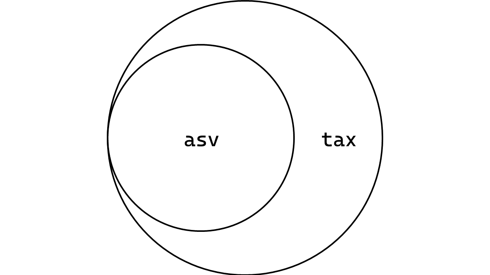

# Relational data

!!! note "Lesson objectives"

    * Understand the concepts in relational data
    * Understand the different `join` functions
    * Use `join` functions to combine tables

## A brief introduction to relational data

Data analysis rarely involves only one data source. In many cases, insightful conclusions (and hypotheses) can only be gleaned and built by combining data from multiple sources. Collectively, this type of data is termed relational data, where the relationships between data points are of primary importance. Relational data is widespread in biology and you have probably encountered and generated it during your research. The table below outlines some cases where relational data can arise from:

| Case                                                                           | Example scenario                                                                                                                               |
| ------------------------------------------------------------------------------ | ---------------------------------------------------------------------------------------------------------------------------------------------- |
| Subjecting the same data to different types of analyses                        | Based on an amino acid sequence, predict signal peptide sequences, active site motifs, and secondary structures using different software.      |
| Collecting and analysing different data from the same sample.                  | Correlate chemical measurements of different metabolites with sequence variants within a population.                                           |
| Comparing your data with data available in the literature or public databases. | Identify homology between your set of sequences and those in NCBI’s RefSeq and then query the sequence’s role in metabolism via gene ontology. |

Almost all modern databases rely on concepts derived from relational data. For example, searching for something in NCBI will return matches across various databases (e.g., Gene, Protein, Nucleotide, etc.). When you access one of the records you will see links to other NCBI databases for that record (e.g., Taxonomy, Conserved Domains, BioProjects, etc.). Moreover, the use of controlled vocabulary across biological databases (e.g., KEGG orthology (KO), enzyme commission (EC) numbers, transporter classification (TC) numbers, GO IDs, etc.) has made it easier to cross-reference information stored in other databases.

### The *key* to relational data

An essential characteristic of relational data is that data across multiple tables are connected via *keys*. You can think of keys as IDs. When analysing tabular biological data there is often a sequence ID (almost always based on the FASTA header) and other accompanying information (e.g., prediction scores, alignment scores, and other statistics). Let’s say we annotated this sequence using BLAST and set it to produce a tabular output (`-outfmt 6`). BLAST would use the sequence header as the query ID/accession, and there would be another subject ID/accession column for hits in the database. This subject ID can then be used as a key to access other information kept in another table, perhaps taxonomic lineage, functional information, or even other accessions/IDs/keys to other records maintained in other databases. 

<!-- Figure: An image of a BLAST table, linked with other tabular information -->

## Managing relational tabular data in R using `dplyr`

To help us combine tabular data in R, we will use a set of `*_join()` functions from the `dplyr` package. Join functions can be used to add columns from one dataset to another dataset. If you are familiar with the relational database management system SQL, you should feel comfortable with these functions’ relational operations. These functions will return a `NA` for non-matching keys or missing observations while preserving valid joins for other observations. The functions are split into two categories depending on the output, namely **mutating joins** and **filtering joins**. The sub-sections below aim to summarise how the joins work. If you would prefer a Cartesian representation of the joins this [book section](https://r4ds.hadley.nz/joins.html#how-do-joins-work) may be helpful in genuinely grasping the procedure.

!!! note "Joining keys"

    By default, all join functions will look for columns with the same name across both tables and attempt a join by specifying those columns as keys. In addition, all join functions have a `by` argument that allows you to determine which columns should be considered as keys across both tables. 

    ```r
    left_join(x, y, by = c("patient_id", "treatment_id"))
    ```

    The code above `mutate()` new columns into table `x` based on matching keys found in the `patient_id` and `treatment_id` columns in both tables `x` and `y`.

    This is also handy when tables have columns with matching values (keys) but are named differently.

    ```r
    left_join(x, y, by = c("patient_id" = "Hospital_ID"))
    ```

    Above, the tables `x` and `y` are joined based on key values named `patient_id` in table `x` and `Hospital_ID` in table `y`.

### Mutating joins

These combine columns from two tables by adding new columns (i.e., `mutate()`) to table `x` from table `y`. These new columns are added **to the right of table `x`**. There are four mutating joins split into two sub-categories, namely inner and outer joins.

| Join type  | Function           | Description                                                                  |
| ---------- | ------------------ | ---------------------------------------------------------------------------- |
| Inner join | `inner_join(x, y)` | Add columns for observations with matching keys in both `x` and `y`.         |
| Outer join | `left_join(x, y)`  | Add columns for observations with matching keys in `x` but not in `y`.       |
| Outer join | `right_join(x, y)` | Same as `left_join()`, but preserves all observations in `y` instead of `x`. |
| Outer join | `full_join(x, y)`  | Add columns for all observations in both `x` and `y`.                        |

### How are our data frames related? An experiment with mutating joins

At the beginning of the workshop, we have imported 3 data frames. 

<!-- image of X, Y, Z matrices -->

??? question "How are these tables related?" 
    
    `View()` each of them to get a feel for how these tables are related.

    ??? success "Solution"

        * `asv` and `tax` are related by the same hash (md5 checksum) key, but they are named `ASVID` in `asv` and `Feature_ID` in `tax`.
        * `asv` and `env` are related based on column names in `asv` and `sample` column in `env`.

        This is a graphical representation of their relationship with each other:

Let's experiment how mutating joins work in practice using tables `asv` and `env`.

!!! r-project "code"

    ```r
    asv_tax_left <- left_join(asv, tax, by = c("ASVID" = "Feature_ID"))
    asv_tax_right <- right_join(asv, tax, by = c("ASVID" = "Feature_ID"))
    asv_tax_inner <- inner_join(asv, tax, by = c("ASVID" = "Feature_ID"))
    asv_tax_full <- full_join(asv, tax, by = c("ASVID" = "Feature_ID"))
    ```

The four data frames have $\gt$ 4 thousand lines and 24 columns. We could explore the results of the different joins using `View()`, but that might take awhile. Instead, let's use some fundamental properties of the data to deduce how the results differ. These properties are:

* Dimensions
* Existence of `NA`

**Dimensions (size of data frames)**

We will check the number of rows and columns in our newly created data frames and compare them against the original data frames `asv` and `tax`. We can do this by inspecting the top-right panel in RStudio or using the `dim()` function.

All joined data contains 24 columns. In general, we should be expect to have 

```r 
ncol(x) + ncol(y) - (2 * length(keys))
``` 

columns in the joined data.

Depending on the type of join, we have different number of rows for each joined data frame. Data frames `asv_tax_left` and `asv_tax_inner` have 4031 rows (the same as `asv`), whereas `asv_tax_right` and `asv_tax_full` have 4227 rows (the same as `tax`). Why is that?

??? success "Discrepancies in row numbers."

    === "`asv_tax_left`"

        Recall that `left_join()` adds columns from the `tax` to the table `asv` based on matching observations in `asv`. This means that you should expect to obtain the same number of rows as in `asv` regardless of right table (with an [exception](#duplicated-keys)).

    === "`asv_tax_right`"

        When using `right_join()`, it is crucial to remember that while we are still joining columns to `asv` from `tax`, the resulting joined data frame is **based on matches in `tax`**. While the arrangement of columns look similar to that of `asv_tax_left`, the joining is based on keys in `tax`, not `asv`. 

    === "`asv_tax_inner`"

        When using `inner_join()`, we are retaining rows with matches in **both** `asv` and `tax`. Given that the resulting number of rows here is equal to that of `asv_tax_left`, this should hint at the shape of the relationship between these two data frames.

    === "`asv_tax_full`"

        This is the union of both data frames `asv` and `tax`. As long as keys exist in both data frames, the columns will join.

**Existence of `NA`**

As explored in the above sections, we know the following statements are `TRUE`:

```r
nrow(tax) > nrow(asv)
dim(asv_tax_left) == dim(asv_tax_inner)
dim(asv_tax_right) == dim(asv_tax_full)
```

Therefore, where the number of rows in our joined data frames are similar to `tax`, that means there are non-matching keys, ergo `NA`s. We can quickly run a check to confirm our suspicions:

!!! r-project "code"

    ```r
    anyNA(asv_tax_left)
    anyNA(asv_tax_inner)
    anyNA(asv_tax_right)
    anyNA(asv_tax_full)
    ```

    > ```
    > [1] FALSE
    > [1] FALSE
    > [1] TRUE
    > [1] TRUE
    > ```

**Venn diagram of our data**

Based on the information above, our data can be represented using a Venn diagram as below.



$$
\Large
\textrm{keys}(\texttt{asv}) \in \textrm{keys}(\texttt{tax})
$$

**Practical usage**

Of the four mutating joins, `left_join()` is often the default choice. In a block of code, it is syntactically easier to understand it's operation, especially if the code block consists of multiple chaining pipes.

??? question "Why use `inner_join()` and `full_join()`? An anecdotal account."

    Occasionally, there are compelling reasons to dabble in `inner_join()` and `full_join()`. Many bioinformatics analyses are run in parallel (e.g., annotations against multiple databases or sequence curation using multiple software) to obtain as much information as possible. Essentially, these are identical sequences analysed in different ways.

    Let’s assume that we are interested in well-characterised genes and pathways. Multiple analyses should produce concordant results for a subset of sequences thereby reducing the chance of false positives or hits with low probability of homology (e.g., a query sequence with homology to citrate synthase should be found regardless of annotation against KEGG, NCBI RefSeq, or UniProt databases). In this scenario, using `inner_join()` will create a table that includes only those results that are consistent across analyses.

    Under different circumstances we might be interested in looking at all the outputs captured by multiple analyses. For example when looking for novel or less well-characterised genes, suspect some analyses may propagate database biases, or want to perform further analyses to eliminate redundancies based on home-grown criteria. Here, we are likely more interested in preventing false negatives. In this case use `full_join()` to preserve all data points for further curation.


### Filtering joins

These joins filter table `x` based on matches with table `y`. There are only two members of this category:

| Function          | Description                                                        |
| ----------------- | ------------------------------------------------------------------ |
| `semi_join(x, y)` | Filter table `x` to **retain** rows based on matching keys in `y`. |
| `anti_join(x, y)` | Filter table `x` to **remove** rows based on matching keys in `y`. |

If you are joining tables based on one key, these functions are equivalent to the following:

```r
# semi_join(x, y)
filter(x, key %in% y$key)

# anti_join(x, y)
filter(x, !(key %in% y$key))
```

??? question "If `filter()` works, why use with filtering joins?"

    Filtering joins come in handy when you have to filter by multiple keys. You can probably use `filter()` for a few keys (1 – 3 columns, your mileage may vary). However, it gets cumbersome quickly if you have too many or if they might be named differently. Perhaps you may have an expert collaborator who has done some curation of your results for you and produced a table. Using a `semi_join()` will likely save you time (and lines of code) to create a table you can analyse downstream. Think of the poor reader who has to figure out which column things are being filtered by!

### What is NOT in our data?

We have established that `asv` only contains some of ASVs identified by QIIME2 and that `tax` has more records. So, what was left out of `asv` that is still in `tax`? How would we find out?

??? success "Solution"

    Recall that we are interested to know what is in `tax` that is NOT in `asv`. `anti_join()` requires that the table to be filtered to be on the left.

    ```r
    tax_asv_anti <- anti_join(tax, asv, by = c("Feature_ID" = "ASVID"))
    ```

    `View()` the created data frame to inspect what might be different. 

## Duplicated keys

The ASV data here is identified using a md5 hash key. This means that if we were to add more sequences to the pile and recreate the count and taxonomy table, the new sequences will simply be appended to the already existing data. What if you were working with data that may contain duplicate key values? 

In those cases, the default behaviour of mutating joins is to output the Cartesian product of both data frames based on their keys. That is to say, all combinations of the keys will be used to generate the newly joined table.


