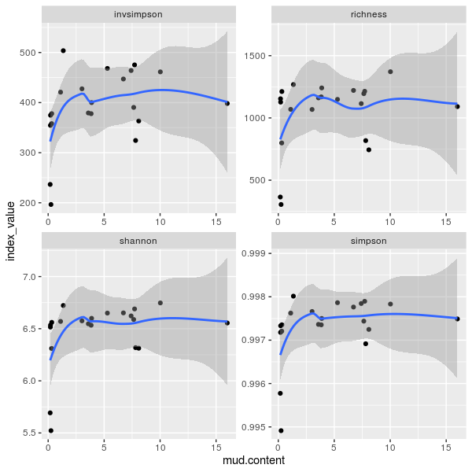
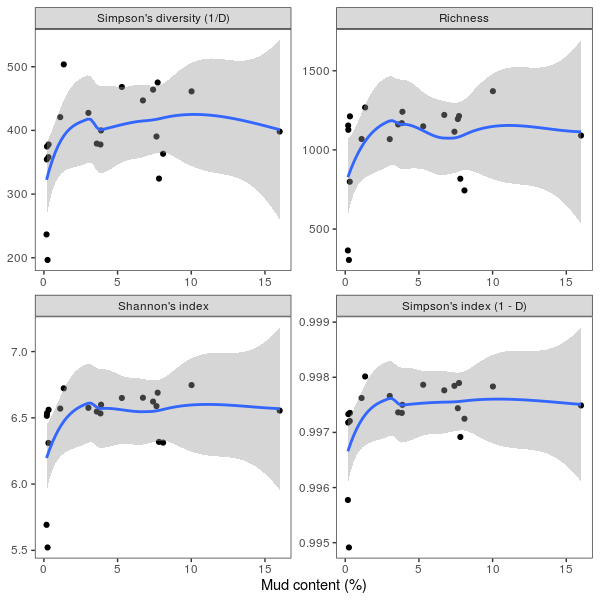

# Functions and loops

## Functions

Learning objectives:

* Understand the anatomy of a function
* Be able to write a function
* Write functions that have predictable outputs
 
Think of functions as verbs. They do something to your data and generates some output. In your R journey, you have been using pre-coded functions. Here, we will write our own functions to perform some task. All functions have the following structure:

```r
do_something <- function(x, y) {
  # ...doing something with x and y...
  # Addition of x and y
  x + y
}
```

In the pseudo-code above, we have a function *named* `do_something` that takes *arguments* `x` and `y` and then a *body* enveloped by `{...}` that has code performing an addition between the arguments.

### Understanding functions by writing one

A cornerstone concept in ecology is species diversity. This pertains to how organisms are distributed across space. Simplified in the form of a question: "How diverse is a sample?" The most direct measure of diversity is richness (often denoted using the letter $q$). This is essentially the number of organisms present in a sample. For any sample (remember, these are columns) in our ASV table, we can obtain richness by counting the number of non-zero elements in the column vector:

!!! r-project "code"

    ```r
    # The species richness of sample AS1A1
    sum(asv$AS1A1 > 0)
    ```

    !!! success "Output"

        ```
        [1] 1221
        ```

For a simple measure of richness, you can probably do this manually via copy-paste for multiple sample:

!!! r-project "code"

    ```r
    sum(asv$AS1A2 > 0)
    sum(asv$AS1A3 > 0)
    sum(asv$AS1B1 > 0)
    sum(asv$AS1B2 > 0)
    # etc...
    sum(asv$S3C3 > 0)
    ```

    !!! success "Output"

        ```
        [1] 744
        [1] 1149
        [1] 1169
        [1] 1161
        [1] 305
        ```

One drawback with richness is that the measure gives equal weight to abundant and rare organisms. Another measure of sample diversity is the Shannon index (denoted with the Greek uppercase eta $\eta$, $\textrm{H}$ as it was originally conceived as a measure of information **entropy**). This is calculated using the following formula:

$$\textrm{H} = - \sum_{i=1}^{q} {p_i} \log {p_i}$$

where $p_i$ is the proportion of the $i$<sup>th</sup> organism relative to the sample total (also known as the relative frequency of the organism).

$$p_i = \frac{x_i}{\sum_{i=1}^{q} x_i}$$

If you were to calculate the Shannon's index for a sample, if would look like this:

!!! r-project "code"

    ```r
    # Calculate the relative frequency of each ASV
    p_AS1A1 <- asv$AS1A1 / sum(asv$AS1A1)
    # Calculate the multiplication between relative frequencies and its log
    pp_AS1A1 <- - p_AS1A1 * log(p_AS1A1)
    # Calculate the Shannon's index
    sum(pp_AS1A1, na.rm = TRUE)
    # Note that you will need na.rm = TRUE as there are zeroes in the vector and the logarithm of zero is NaN (it is not mathematically defined)
    ```

    !!! success "Output"

        ```
        [1] 6.651707
        ```

Technically, we could condense the above code into a single chunk:

!!! r-project "code"

    ```r
    sum(- (asv$AS1A1 / sum(asv$AS1A1)) * log((asv$AS1A1 / sum(asv$AS1A1))), na.rm = TRUE)
    ```

This will still work, but it is difficult to read. The equation for Shannon's index is simple enough that this is still decipherable. But it can quickly become unruly if equations are more complicated or have dependencies on other pre-calculated values. Moreover, this is not easily reusable. This is when turning equations or any multi-step calculations into functions really shine.

We can turn the 3-step calculations into a function to obtain one value, like so:

!!! r-project "code"

    ```r
    diversity_index <- function(abundance) {
      # Calculate relative frequency
      p_i <- abundance / sum(abundance)
      # Calculate multiplication between relative frequencies and its log
      pp_i <- p_i * log(p_i)
      # Calculate Shannon's index
      - sum(pp_i, na.rm = TRUE) 
    }
    ```

Here, we have written a function that calculates the index and provided it with an informative name. Lets try it out and see if we get the same output:

!!! r-project "code"

    ```r
    diversity_index(abundance = asv$AS1A1)
    ```

    !!! success "Output"

        ```
        [1] 6.651707
        ```

### Conditional statements inside functions

What if we wanted to evaluate different diversity indices? We can create conditional statements within the functions to take in arguments. For this example, we will also add another diversity index, the Simpson's concentration index ($\lambda$), which shares some similarities with Shannon's index.

$$\lambda = \sum_{i=1}^{q} {p_i}^2$$

However, unlike Shannon's index, the property of Simpson's concentration index is such that tha larger the value of $\lambda$, the less evenly distributed the organisms in the sample. Hence the name "concentration index", where the larger the value, the more concentrated the distribution of the community members. To make the relationship between diversity and value magnitude the same between indices, Simpson's diversity index is usually denoted as $\textrm{D} = 1 - \lambda$ or $\textrm{D} = \frac{1}{\lambda}$. We can account for that in our function argument as well.

!!! r-project "code"

    ```r
    diversity_index <- function(abundance, index = "shannon", log.base = exp(1)) {
      
      # Calculate richness
      if (index == "richness") {
        result <- sum(abundance > 0)
      }

      # As both Shannon's and Simpson's concentration indices require p_i,
      # calculate that first
      p_i <- abundance / sum(abundance)
      
      # Calculate Shannon's index
      if (index == "shannon") {
        pp_i <- p_i * log(p_i, base = log.base)
        result <- - sum(pp_i, na.rm = TRUE)
      }

      # Calculate Simpson's diversity index
      if (index == "simpson") {
        pp_i <- p_i ^ 2
        result <- 1 - sum(pp_i)
      }

      if (index == "invsimpson") {
        pp_i <- p_i ^ 2
        result <- 1 - sum(pp_i)
      }

      # Generate final result
      result

    }
    ```

In the function above, we have modified the function to take 3 arguments:

* `abundance`: A numeric vector of counts
* `index`: The diversity index desired
* `log.base`: The base for the logarithm calculation for Shannon's index

Notice that for `index` and `log.base`, we pre-populate the function arguments with values `"shannon"` and `exp(1)`. This means that those are default values for the function. If you were to directly call the function without supplying anything other than `abundance`, it would return Shannon's index calculated in the scale of the natural log. If we wanted to calculate the Shannon's index with a different log base, we simply add our own value to the `log.base` argument.

!!! r-project "code"

    ```r
    diversity_index(abundance = asv$AS1A1, log.base = 2)
    ```

    !!! success "Output"

        ```
        [1] 9.596384
        ```

If we wanted to get Simpson's concentration index:

!!! r-project "code"

    ```r
    diversity_index(abundance = asv$AS1A1, index = "simpson")
    ```

    !!! success "Output"

        ```
        [1] 0.9972477
        ```

### Things that might go wrong

At this point, we have written a function `diversity_index()` that calculates 3 different indices and can adjust for different choices of log bases. However, there are some weaknesses to our function. Have a think before moving forward what they might be.

??? tip "Weak points of `diversity_index`"

    * `NA` handling only for Shannon's index as is required (log of 0 is undefined) but not others (What if input vector contains missing values?)
    * Redundancy in calculating `pp_i` for derivatives of Simpson's index (`pp_i` is the same regardless of calculating Simpson's diversity or it's inverse)
    * No explicit way of knowing correct argument values without looking at code (Will you remember what the arguments are 12 months from now?)
    * No error handling of inappropriate types of data or negative values (`index = "shannon"` might provide useful error messages, but other indices will provide an output as normal)

To mitigate some of the potential issues, we might want to restrict how our function evaluates and processes input, as well as have the function provide useful error messages in case of problems. Here, two base R functions are useful:

* `stop()` creates an error message and stops the execution of the following lines of code in the body.
* `match.arg()` allows for partial matching of argument values and also produces a helpful error message on what are appropriate values if there is a typo.
* `switch()` allows for different evaluations depending on the argument without chaining multiple if...else statements to make code more readable.

!!! r-project "code"

    ```r
    diversity_index <- function(abundance, index = "shannon", log.base = exp(1)) {
      # Ensure abundance is a vector of positive numeric values
      if (!is.numeric(abundance) || any(abundance < 0, na.rm = TRUE)) {
        stop("Abundance data must be numeric and positive!")
      }

      # Check if missing values are to be ignored
      if (any(is.na(abundance))) {
        cat("Input contains missing values, returning NA.\n")
        return(NA)
      }

      # Match arguments to appropriate index
      indices <- c("richness", "shannon", "simpson", "invsimpson")
      index <- match.arg(index, indices)

      # Pre-calculate p_i and pp_i
      p_i <- abundance / sum(abundance)

      if (isTRUE(str_detect(index, "simpson"))) {
        # Simpson's
        pp_i <- p_i ^ 2
      } else {
        # Shannon's
        pp_i <- - p_i * log(p_i, base = log.base)
      }

      H <- sum(pp_i, na.rm = TRUE)

      # Final output
      result <- switch(
        index,
        shannon = H,
        richness = sum(abundance > 0),
        invsimpson = 1 / H,
        simpson = 1 - H
      )

      result

    }
    ```

Now, let's try the new function under various scenarios. Using sample S3C1 as an example, we will test if it properly handles the following scenarios:

* Handles missing values depending on `na.rm` arguments
* Checks input data type
* Checks input data range

!!! r-project "code"

    ```r
    # Extract column S3C1 as a test vector and sort it for convenience
    test_vector <- sort(asv$S3C1, decreasing = TRUE)
    # Introduce NA into test vector
    test_missing <- test_vector
    test_missing[c(6, 8, 12)] <- NA
    # Introduce negative values into test vector
    test_negative <- test_vector
    test_negative[c(6, 8, 12)] <- -test_vector[c(6, 8, 12)]
    # Add characters into test vector
    test_char <- test_vector
    test_char[c(6, 8, 12)] <- as.character(test_char[c(6, 8, 12)]) 

    # Test our modified function to calculate the inverse Simpson's diversity
    diversity_index(test_vector, index = 'inv')
    diversity_index(test_missing, index = 'inv')
    diversity_index(test_negative, index = 'inv')
    diversity_index(test_char, index = 'inv')
    ```

    !!! success "Output"

        ```
        [1] 236.654

        Input contains missing values, returning NA.
        [1] NA

        Error in diversity_index(test_negative, index = "inv") : 
          Abundance data must be numeric and positive!

        Error in diversity_index(test_char, index = "inv") : 
          Abundance data must be numeric and positive!
        ```

!!! tip "Checking results of `diversity_index()`"

    In the package `vegan`, there is a function that is equivalent to `diversity_index()` called `diversity()`. You can check if the results of `diversity_index()` is the same as that produced by `vegan::diversity()`.

!!! tip "Improve function writing"

    Writing good functions is an art in itself. I find it helpful to model how I write functions by reading and studying the source code of pre-coded functions in R packages. By reading other people's code, I also learn other helpful functions that were previously unknown to me or ways to deploy familiar functions that may help me solve problems in other areas. 
    
    In RStudio, you can lookup the source code for most functions using `View(<function_name>)`. For example, here is a snapshot of the source code for the function `diversity()` from the `vegan` package:

    !!! r-project "code"

        ```r
        View(vegan::diversity)
        ```

        ??? success "Output"

            ```r
            function (x, index = "shannon", groups, equalize.groups = FALSE, 
              MARGIN = 1, base = exp(1)) 
            {
              x <- drop(as.matrix(x))
              if (!is.numeric(x)) 
                stop("input data must be numeric")
              if (any(x < 0, na.rm = TRUE)) 
                stop("input data must be non-negative")
              if (!missing(groups)) {
                if (MARGIN == 2) 
                  x <- t(x)
                if (length(groups) == 1) 
                  groups <- rep(groups, NROW(x))
                if (equalize.groups) 
                  x <- decostand(x, "total")
                x <- aggregate(x, list(groups), sum)
                rownames(x) <- x[, 1]
                x <- x[, -1, drop = FALSE]
                if (MARGIN == 2) 
                  x <- t(x)
              }
              INDICES <- c("shannon", "simpson", "invsimpson")
              index <- match.arg(index, INDICES)
              if (length(dim(x)) > 1) {
                total <- apply(x, MARGIN, sum)
                x <- sweep(x, MARGIN, total, "/")
              }
              else {
                x <- x/(total <- sum(x))
              }
              if (index == "shannon") 
                x <- -x * log(x, base)
              else x <- x * x
              if (length(dim(x)) > 1) 
                H <- apply(x, MARGIN, sum, na.rm = TRUE)
              else H <- sum(x, na.rm = TRUE)
              if (index == "simpson") 
                H <- 1 - H
              else if (index == "invsimpson") 
                H <- 1/H
              if (any(NAS <- is.na(total))) 
                H[NAS] <- NA
              H
            }
            ```
      
      For functions that are coded in other methods, here is an immensely helpful [page on stackoverflow](https://stackoverflow.com/questions/19226816/how-can-i-view-the-source-code-for-a-function) that illustrates multiple ways of obtaining function source codes.


## Iteration using loops

Learning objectives:

* Understand the `for` construct
* Be able to assign results of an iteration to object
* Understand different kinds of iterations
* Understand nested loops

### The anatomy of a loop

In the previous section, we have written a function that takes a numeric vector input and produces a single numeric or `NA` output. Copy-pasting and changing input variables is okay for a few inputs, but there are 21 samples in our ASV table! Thankfully, computers are very good at doing the same things multiple times, quickly. This is known as iteration. The basic form of iteration in R (and most other programming languages) is a `for` loop. We will look at the anatomy of a `for` loop in R using an example:

```r
loop_output <- vector(mode = "character", length = ncol(asv)) # Output

for (i in seq_along(asv)) {                                   # Sequence
  
  loop_output[i] <- typeof(asv[[i]])                          # Body
  names(loop_output)[i] <- names(asv)[i]                      # Body

}
```

Let's dissect what is going on in the code above:

1. We create an empty output vector `loop_output` using `vector()` with the same length as the number of columns as the ASV table. 
2. `for (i in seq_along(asv))` represents the sequence by which to loop over. Here, `seq_along(asv)` generates a numeric vector that starts from `1`, ends at the number of columns of `asv` with an increment of `1`. Therefore, this line means "for every number (`i`) from 1 to the number of columns in `asv`, do `{...}`". 
3. Like the `if...else` evaluations, anything within the body of `{...}` represents code to execute. This is the body that does the actual computation. Here, we are assigning the type of vector for each column in `asv` and appending the column name to each vector element in `loop_output`.

### (IMPORTANT) Pre-assigning output objects

It is crucial that you create an output vector of a known length/size prior to assigning outputs of an iteration. This is because by creating the vector first, you allocate some memory to store the output. Technically, you can populate a vector of length 0 like so:

!!! r-project "code"

    ```r
    loop_output <- c()
    for (i in seq_along(asv)) {
      loop_output[i] <- typeof(asv[[i]])
      names(loop_output)[i] <- names(asv)[i]
    }
    ```
    
**This is not advisable.** If we had a code that produce voluminous outputs, we would wait for it to iterate for a long time only for the programme to terminate because there was insufficient memory.

If we truly do not know the exact size of the output *a priori*, we should know the maximum number of elements the loop would produce (we will try this below). In this case, create a vector of such a size then filter out the empty elements in post-processing. This is much safer.

### Different kinds of loop construction

The first loop example is an iteration over a sequence of numbers. More specifically, it was an iteration over the indices of the columns of a data frame (i.e., iterating over column 1, then column 2, then column 3, etc.). Iterating over a sequence of numbers is quite natural and intuitive as it resembles counting: compute this on item 1, on item 2, on item 3, ...on item N. 

That is not the only way to iterate over a vector. You could also iterate over the elements themselves.

!!! r-project "code"

    ```r
    for (i in asv) {
      if (is.numeric(i)) {
        plot(
          density(log(i))
        )
      }
    }
    ```

    ??? success "Example output"

        {width="600"}      

The code above iterates over the columns of our `asv` data frame and produces a density plot for logarithmic transform of each numeric column (i.e., the distribution of ASVs in log-scale). Notice that the title is not informative (we don't know which sample this is), and we've made 21 of these!

> If you added `main = i` to the plot, it will assign the entire column vector as the title across the middle of the plot. Not very informative, but maybe cool t-shirt design?

Another way to produce a similar plot is to iterate the names of a vector.

!!! r-project "code"

    ```r
    for (i in names(asv)) {
      if (is.numeric(asv[[i]])) {
        plot(
          density(log(asv[[i]])), main = i
        )
      }
    }
    ```

    ??? success "Example output"

        {width="600"}

This is useful for this particular case, but not so much for vectors without named elements. More often than not, iterating over indices is the most useful way to construct a loop sequence as we can capture both the vector and its name.

!!! r-project "code"

    ```r
    for (i in seq_along(asv)) {
      if (is.numeric(asv[[i]])) {
        plot(
          density(log(asv[[i]])), main = names(asv)[i]
        )
      }
    }
    ```

!!! tip "Iterate along rows"

    In the above examples, we used `seq_along()` to iterate each column of the `asv` data frame. To iterate along the rows, you can modify the sequence to this:

    !!! r-project "code"
    
        ```r
        for (i in seq_len(nrow(asv))) {
          x <- as.numeric(asv[i, -1])
          nx <- asv[i, 1]
          plot(
            density(log(x)), main = nx
          )
        }
        ```

### Nested loops

Just as we can create nested lists, we can also construct nested loops:

```r
for (i in seq_along(x)) {
  # Do something here, or skip and continue with loop
  for (j in seq_along(y)) {
    # Do something here
  }
  # Can do something here too!
}
```

These are useful for iterating through multiple vectors. Crucially, the vectors do not need to be the same length:

!!! r-project "code"

    ```r
    x <- LETTERS[1:3]
    y <- seq(from = 2, to = 10, by = 2)

    for (i in seq_along(x)) {
      for (j in seq_along(y)) {
        print(paste(x[i], y[j]))
      }
    }
    ```

    !!! success "Output"

        ```
        [1] "A 2"
        [1] "A 4"
        [1] "A 6"
        [1] "A 8"
        [1] "A 10"
        [1] "B 2"
        [1] "B 4"
        [1] "B 6"
        [1] "B 8"
        [1] "B 10"
        [1] "C 2"
        [1] "C 4"
        [1] "C 6"
        [1] "C 8"
        [1] "C 10"
        ```

### Assigning outputs from nested loops

Notice that the loop generated a printed output with the size of 15, where it is `length(x) * length(y)`. If we were to assign the outputs to an object, how would we do that? Give it a think and see if you come up with solutions similar to those below!

??? success "Solutions"

    === "Method 1"

        Use an external additive counter per iteration. This is useful if outputs need to be strictly kept in the form of a 1 dimensional vector.

        ```r
        z <- 1

        output <- vector(mode = "character", length = length(x) * length(y))

        for (i in seq_along(x)) {
          for (j in seq_along(y)) {
            output[z] <- paste(x[i], y[j])
            z <- z + 1
          }
        }
        ```

    === "Method 2"

        Use a nested list by designating one of the vectors to be a level above the other. This is most intuitive to me and does not require additional counters and is flexible for further list-based manipulation as required. 
        
        If data need to be in the form of a 1 dimensional vector, simply `unlist()`.

        ```r
        output <- vector(mode = "list", length = length(x))

        for (i in seq_along(x)) {
          for (j in seq_along(y)) {
            output[[i]][j] <- paste(x[i], y[j]) 
          }
        }

        # Generate 1 dimensional vector
        unlist(output)
        ```

    === "Method 3"

        Use a matrix to store outputs. Think of the index of each vector as rows and columns and populating the matrix with outputs. This is a great method for generating correlation tables if you have matrices of unequal dimensions. 

        If outputs need to be 1 dimensional, convert it using `as.vector()`. Take note that this populates the vector column-wise. Transpose the output prior to conversion if row-wise appending is required.

        ```r
        output <- matrix(nrow = length(x), ncol = length(y))

        for (i in seq_along(x)) {
          for (j in seq_along(y)) {
            output[i, j] <- paste(x[i], y[j])
          }
        }

        # Convert to vector, column-wise
        as.vector(output)

        # Convert to vector, row-wise
        as.vector(t(output))
        ```

### Flow control in loops

We have seen how we can control what code is run using conditional statements. This is also applicable in loops. There are two main constructs that are important to know are also helpfully named:

* `break` exists from the innermost loop (usually constructed as `if` the expression is `TRUE`, `break` out of the current loop)
* `next` causes the loop to skip everything in the current iteration and starts the next iteration (usually constructed as `if` the expression is `TRUE`, stop the current iteration and start the `next` iteration)

It is easier to see them in action to understand what they do.

!!! r-project "code"

    === "`break`"

        Here we construct a nested loop that iterates a sequence of numbers 1 to 5. However, when the inner loop hits an even number, it will stop the loop and start again at the outer loop.

        ```r
        for (i in 1:5) {
          for (j in 1:5) {
            if (j %% 2 == 0) {
              break
            }
            print(
              paste0("Outer loop, i: ", i, "; Inner loop, j: ", j)
            )
          }
        }
        ```

        !!! success "Output"

            ```
            [1] "Outer loop, i: 1; Inner loop, j: 1"
            [1] "Outer loop, i: 2; Inner loop, j: 1"
            [1] "Outer loop, i: 3; Inner loop, j: 1"
            [1] "Outer loop, i: 4; Inner loop, j: 1"
            [1] "Outer loop, i: 5; Inner loop, j: 1"
            ```
    
    === "`next`"

        Here we construct a nested loop that iterates the sequence of numbers 1 to 5. However, at even numbers, the loop will skip to the next iteration.

        ```r
        for (i in 1:5) {
          for (j in 1:5) {
            if (j %% 2 == 0) {
              next
            }
            print(
              paste0("Outer loop, i: ", i, "; Inner loop, j: ", j)
            )
          }
        }
        ```

        !!! success "Output"

            ```
            [1] "Outer loop, i: 1; Inner loop, j: 1"
            [1] "Outer loop, i: 1; Inner loop, j: 3"
            [1] "Outer loop, i: 1; Inner loop, j: 5"
            [1] "Outer loop, i: 2; Inner loop, j: 1"
            [1] "Outer loop, i: 2; Inner loop, j: 3"
            [1] "Outer loop, i: 2; Inner loop, j: 5"
            [1] "Outer loop, i: 3; Inner loop, j: 1"
            [1] "Outer loop, i: 3; Inner loop, j: 3"
            [1] "Outer loop, i: 3; Inner loop, j: 5"
            [1] "Outer loop, i: 4; Inner loop, j: 1"
            [1] "Outer loop, i: 4; Inner loop, j: 3"
            [1] "Outer loop, i: 4; Inner loop, j: 5"
            [1] "Outer loop, i: 5; Inner loop, j: 1"
            [1] "Outer loop, i: 5; Inner loop, j: 3"
            [1] "Outer loop, i: 5; Inner loop, j: 5"
            ```

        One other thing to note is that skips in iteration triggered by `next` returns `NULL` or `NA` values.

!!! tip "Paste and print outputs!"

    When first learning how to use functions and iteration, I found that writing simple constructs that pasted some output and printed it to terminal to be immensely helpful. It can help us check if the functions and constructs are doing what we want them to do. It also exposes what the flow control elements (`if...else`, `break`, and `next`) are doing in a tangible way.  When I write functions that include control elements, I tend to paste-print intermediate outputs with helpful prompts so I know what is being done, especially if I need to iterate through multiple objects. I strongly recommending putting into practice adding paste-print lines of code into complex code blocks to help diagnose, troubleshoot, and understand what is actually happening to your data.

Personally, I find myself using `next` more often than `break`. I'd rather a loop return empty values than completely `break` out from an iteration so I can keep track of the process. I can always subset the object later to remove empty values.

## Activity: Trends in diversity

We will try to use all that we have learned up to now to create a panelled figure that illustrates how diversity changes with out environmental factor of interest: mud content. This will be a scatter plot (`geom_point()`) decorated with a non-parametric trend line (`geom_smooth(method = "loess")`). 

### Step 1: Calculate diversity indices per sample

Here, we need to combine a nested loop and flow control to iterate our custom function `diversity_index()` through the `asv` data frame. We also want to store all the data in an object. 

> Feel free to add paste-print lines to help you troubleshoot the loop.


!!! r-project "code"

    ```r
    # Generate a vector of diversity indices
    indices <- c("richness", "shannon", "simpson", "invsimpson")

    # Generate an object of known size to store outputs
    sample_diversity <- vector(mode = "list", length = ncol(asv))

    # Iterate through columns of asv data frame
    for (column in seq_along(asv)) {
    
      # Iterate through the indices
      for (index in diversity_indices) {
      
        # Flow control to only allow numeric data to be processed
        if (!is.numeric(asv[[column]])) {
          next
        }

        # Assign diversity index calculations to output object
        sample_diversity[[column]][index] <- diversity_index(asv[[column]], index = index)
      }

      # Assign names to each outer list
      names(sample_diversity) <- names(asv)
    }

    # Check output
    head(sample_diversity)
    ```

    !!! success "Output"

        ```
        $ASVID
        NULL

        $AS1A1
            richness      shannon      simpson   invsimpson 
        1221.0000000    6.6517067    0.9977633  447.0849788 

        $AS1A2
           richness     shannon     simpson  invsimpson 
        744.0000000   6.3129764   0.9972477 363.3345539 

        $AS1A3
            richness      shannon      simpson   invsimpson 
        1149.0000000    6.6498860    0.9978641  468.1816334 

        $AS1B1
            richness      shannon      simpson   invsimpson 
        1169.0000000    6.5333348    0.9973535  377.8543456 

        $AS1B2
            richness      shannon      simpson   invsimpson 
        1161.0000000    6.5473216    0.9973635  379.2908318 
        ```

Notice that the first list that corresponds to the first column of the `asv` data frame `ASVID` has a `NULL` value. This is because it was a `character` vector, which triggered a `next`.

### Step 2: Reshape and join data

The resulting data is in a list, which is not ideal for `ggplot()`. We need reshape the data so that `ggplot()` can read it properly. We also need to add mud content from `env_data` as a column to we have a horizontal axis. 

In the following code, we will pipe the commands to streamline the process:

1. `bind_rows()` compiles the list into a data frame.
2. `pivot_longer()` turns the "wide" data into a "long" data
3. `left_join(select())` combines selected columns from `env_data` to our new data frame based on the sample ID.


!!! r-project "code"

    Compile the list into a data frame

    ```r
    sample_diversity_df <- bind_rows(sample_diversity, .id = "sample") %>%
      pivot_longer(cols = -sample, names_to = "index", values_to = "index_value") %>%
      left_join(
        select(env_data, sample, mud_content), by = "sample"
      )

    head(sample_diversity_df)
    ```

    !!! success "Output"

        ```
        # A tibble: 6 × 4
          sample index      index_value mud.content
          <chr>  <chr>            <dbl>       <dbl>
        1 AS1A1  richness      1221            6.72
        2 AS1A1  shannon          6.65         6.72
        3 AS1A1  simpson          0.998        6.72
        4 AS1A1  invsimpson     447.           6.72
        5 AS1A2  richness       744            8.09
        6 AS1A2  shannon          6.31         8.09
        ```

### Step 3: Plot data

!!! r-project "code"

    ```r
    diversity_plot <- ggplot(sample_diversity_df, aes(x= mud.content, y= index_value)) +
      geom_point() +
      geom_smooth(method = "loess") +
      facet_wrap(~ index, scales = "free") 
    
    diversity_plot
    ```

    ??? success "Output"

        

### (Optional) Step 4: Clean up plot

!!! r-project "code"

    ```r
    diversity_plot +
      labs(x = "Mud content (%)") +
      facet_wrap( ~ index, labeller = labeller(
        index = c(
          "invsimpson" = "Simpson's diversity (1/D)",
          "richness" = "Richness",
          "simpson" = "Simpson's index (1 - D)",
          "shannon" = "Shannon's index"
        )
      ), scales = "free") +
      theme_bw() +
      theme(
        panel.grid = element_blank(),
        axis.title.y = element_blank()
      )
    ```

    ??? success "Output"

        


