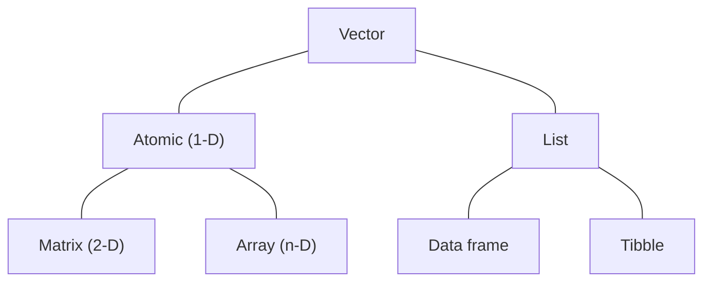

# Data structures

!!! note "Learning objectives"

    * Understand nuances in different data structures in R
    * Understand attributes and how it affects data structures
    * Use tibbles for data storage

## Brief overview of data structures



The chart above summarises the common data structures available in R. Technically, all data objects are vectors. The difference between the colloquial vector (*atomic vector*) and list is the kinds of data they can contain: atomic vectors only store data of the same type in a single dimension (e.g., `c(1, 2, 3, 4, 5)`); lists are *generic vectors* that are able to store data of variable types and can also store other lists (i.e., *recursive*). 

In Introduction to R, we introduced the data frame as a form tabular data storage. Technically, *data frames are special lists*: they contain lists of variables of equal lengths (i.e., cases-by-variables). For practical purposes, think of each column as a vector, and that every vector has the same length that makes up the rows of the data frame.

Special cases of the atomic vector are the matrix and array. The latter two all have one commonality: attributes `dim` and `dimnames`. A matrix is a special 2-dimensional case of an atomic vector (`dim(matrix) == 2`), whereas an array is a multi-dimensional (`dim(array) > 1`). As for `dimnames`, think of them as column and row names for matrices (for arrays, they are just the names of each dimension).

!!! note "Attributes"

    Think of attributes as metadata to the object. Some attributes determines the structure of the data so R can interpret them properly, others are attached as metadata or for purposes of provenance. Every time we perform some action on an object, the object's class attribute will be examined prior to evaluation as some operations are restricted to certain classes. Besides `class()`, other basic attributes include `names()`, dimensions `dim()`, and dimension names `dimnames()`.

Tibble is the only one out of the diagram that is not part of `base` R. It is implemented via the `tibble` package and is the primary way the `tidyverse` stores tabular data. It is similar to a data frame with some key differences:

* Variables and their names are lazily evaluated
* Columns are built sequentially
* Enhanced printing

We will be exploring how to use tibbles and compare it to a data frame in the subsections below.

## Matrix versus data frame, and why the choice matters

While it seems that both matrices and data frames are similar in that they represent data in 2-dimensional structures, there are marked distinctions in how R interprets them. We will prepare a example based on a subset of `asv` to illustrate these differences.

### Structure

!!! r-project "code"

    ```r
    # Example data uses the first 5 numeric columns and rows of asv
    # The ASVID is designated as the row name
    num_df <- data.frame(asv[1:5, 2:6], row.names = asv[1:5, 1])
    num_mt <- as.matrix(num_df)
    ```

    === "Printing"

        ```r
        print(num_df)
        print(num_mt)
        ```

        > ```
        >                                  AS1A1 AS1A2 AS1A3 AS1B1 AS1B2
        > 88c2f5ea8fd2f13cbd43e933049707c9    45    22    37    50    55
        > bab6b4a509dd01b93cbbf78e40616533    81    48    79    96    87
        > 24b484137e882a5c77ea93b4574332e1    70    16    53    86    55
        > 5d112573567f99604339d5d6b92bdea9    35    14    26    63    45
        > 864ea29bffe398510cca601c0ce546c2    61    32    37    72    75
        > ```

        > ```
        >                                  AS1A1 AS1A2 AS1A3 AS1B1 AS1B2
        > 88c2f5ea8fd2f13cbd43e933049707c9    45    22    37    50    55
        > bab6b4a509dd01b93cbbf78e40616533    81    48    79    96    87
        > 24b484137e882a5c77ea93b4574332e1    70    16    53    86    55
        > 5d112573567f99604339d5d6b92bdea9    35    14    26    63    45
        > 864ea29bffe398510cca601c0ce546c2    61    32    37    72    75
        > ```

    === "Structure"

        ```r
        str(num_df)
        str(num_mt)
        ```

        > ```
        > 'data.frame':	5 obs. of  5 variables:
        >  $ AS1A1: int  45 81 70 35 61
        >  $ AS1A2: int  22 48 16 14 32
        >  $ AS1A3: int  37 79 53 26 37
        >  $ AS1B1: int  50 96 86 63 72
        >  $ AS1B2: int  55 87 55 45 75
        > ```

        > ```
        >  int [1:5, 1:5] 45 81 70 35 61 22 48 16 14 32 ...
        >  - attr(*, "dimnames")=List of 2
        >   ..$ : chr [1:5] "88c2f5ea8fd2f13cbd43e933049707c9" "bab6b4a509dd01b93cbbf78e40616533" "24b484137e882a5c77ea93b4574332e1" "5d112573567f99604339d5d6b92bdea9" ...
        >   ..$ : chr [1:5] "AS1A1" "AS1A2" "AS1A3" "AS1B1" ...
        > ```

    === "Class"

        ```r
        class(num_df)
        class(num_mt)
        ```

        > ```
        > [1] "data.frame"
        > ```

        > ```
        > [1] "matrix" "array"
        > ```

    === "Attributes"

        ```r
        attributes(num_df)
        attributes(num_mt)
        ```

        > ```
        > $names
        > [1] "AS1A1" "AS1A2" "AS1A3" "AS1B1" "AS1B2"
        > 
        > $class
        > [1] "data.frame"
        > 
        > $row.names
        > [1] "88c2f5ea8fd2f13cbd43e933049707c9" "bab6b4a509dd01b93cbbf78e40616533" "24b484137e882a5c77ea93b4574332e1"
        > [4] "5d112573567f99604339d5d6b92bdea9" "864ea29bffe398510cca601c0ce546c2"
        > ```

        > ```
        > $dim
        > [1] 5 5
        > 
        > $dimnames
        > $dimnames[[1]]
        > [1] "88c2f5ea8fd2f13cbd43e933049707c9" "bab6b4a509dd01b93cbbf78e40616533" "24b484137e882a5c77ea93b4574332e1"
        > [4] "5d112573567f99604339d5d6b92bdea9" "864ea29bffe398510cca601c0ce546c2"
        > 
        > $dimnames[[2]]
        > [1] "AS1A1" "AS1A2" "AS1A3" "AS1B1" "AS1B2"
        > ```

    === "Size"

        ```r
        length(num_df)
        nrow(num_df)
        ncol(num_df)

        length(num_mt)
        nrow(num_df)
        ncol(num_df)
        ```

        > ```
        > [1] 5
        > [1] 5
        > [1] 5
        > ```

        > ```
        > [1] 25
        > [1] 5
        > [1] 5
        > ```

    === "Iteration"

        ```r
        map_lgl(num_df, is.numeric)
        map_lgl(num_mt, is.numeric)
        ```

        > ```
        > AS1A1 AS1A2 AS1A3 AS1B1 AS1B2 
        >  TRUE  TRUE  TRUE  TRUE  TRUE
        > ```

        > ```
        >  [1] TRUE TRUE TRUE TRUE TRUE TRUE TRUE TRUE TRUE TRUE TRUE TRUE TRUE TRUE TRUE TRUE TRUE TRUE TRUE TRUE TRUE
        > [22] TRUE TRUE TRUE TRUE
        > ```

On printing, there are no differences between data frames and matrices. However, when we inspect the underlying structure, attributes, size, and iteration output of the objects, we find that R interprets them very differently. Perhaps the most convincing observation that data frames are special cases of a list is that when we iterate using `map_lgl()`, the outputs match the number of columns with the column names printed. However, when it was used on the matrix, it returns a Boolean logical with the same length as `nrow(num_mt) * ncol(num_mt)`.

!!! note "Operations"

    Another distinction of matrices and data frames is the operations we can do with them. There are many applications in numerical and statistical analyses that require matrix-based operations: 

    * Addition 
    * Subtraction 
    * Scalar multiplication
    * Transposition
    * Matrix multiplication.

    Of the 5 operations, matrix multiplication only works with matrices; the other operations will work if the input is a numeric data frame, whereas transposition will also produce a valid object but if there are any data types that are not numeric, the entire data frame will be coerced into character variables.

## Tibbles as flexible data storage

Tibbles are lazy data frames. We'll try to describe what this implies for the points mentioned above:

!!! r-project "code"

    ```r linenums="1"
    df_A <- data.frame(
      a = 1:3,
      b = I(matrix(rnorm(6), nrow = 3, ncol = 2)),
      c = I(list(
        matrix(rnorm(6), nrow = 3, ncol = 2),
        matrix(rnorm(6), nrow = 3, ncol = 2),
        as.data.frame(matrix(rnorm(6), nrow = 3, ncol = 2))
        )
      )
    )
    
    tbl_A <- tibble(
      a = 1:3,
      `245` = 3:5,
      b = matrix(rnorm(6), nrow = 3, ncol = 2),
      c = list(
        matrix(rnorm(6), nrow = 3, ncol = 2),
        matrix(rnorm(6), nrow = 3, ncol = 2),
        as.data.frame(matrix(rnorm(6), nrow = 3, ncol = 2))
      )
    )
    ```

    === "Variables and their names are lazily evaluated"

        This means that variables are not coerced into another data type as is commonly done in data frames (characters are often converted to factors). Also, we can store non-atomic vectors within tibbles without extra effort (compare lines 3-9 to lines 14-19). Furthermore, column names with characters that are illegal in base R (i.e. with spaces) are returned as is. 

        ```r    
        tbl_A$`245`
        ```

        ```
        [1] 3 4 5
        ```

    === "Columns are built sequentially"

        Consider the following ways of obtaining the third column:

        ```r
        # Construct data frame
        df_B <- data.frame(
          a = 1:5,
          b = 5:9
        )
        df_B$c <- df_B$a * df_B$b
        # Construct tibble
        tbl_B <- tibble(
          a = 1:5,
          b = 5:9,
          c = a * b
        )
        ```

        Both multiply columns `a` and `b` in the respective tables to obtain column `c`. However, notice how in `tibble()` this is done more naturally?

    === "Enhanced printing"

        ```r
        print(asv)
        print(as_tibble(asv))
        print(as_tibble(asv), n = 15, width = 80)
        ```

        Notice the cleaner and informative output of a printed tibble compared to the data frame. Moreover, we can control how many lines (`n`) and number of characters (`width`) we want to see.

## S3 and S4 objects

In R, objects obey different object-oriented programming systems (namely S3, S4, and R6) to define what the objects are. This primarily affects the object's class and how R interprets and processes the object. A large majority of the objects in R follow the S3 system. 

The major difference between the two is that S4 is formally defined and stricter than S3. S4 is generally preferred when building large packages or suites of interacting packages with complex methods so that outputs are consistent and that all code contributors have the same "vocabulary" for handling objects. This is the reason that all packages in Bioconductor are written using the S4 system in mind.

An additional item in S4 is slots, where slot values (think object property) are retrieved using package-specific accessor functions or the symbol `@`. The details that differentiates the systems are too detailed for the average R user and will not be covered here. For further reading, we refer you to the [Object-Oriented Programming section of Advanced R](https://adv-r.hadley.nz/oo.html)
