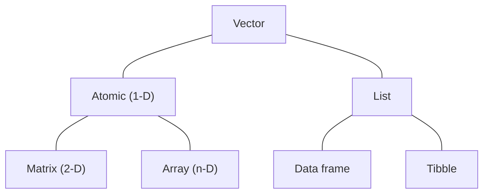
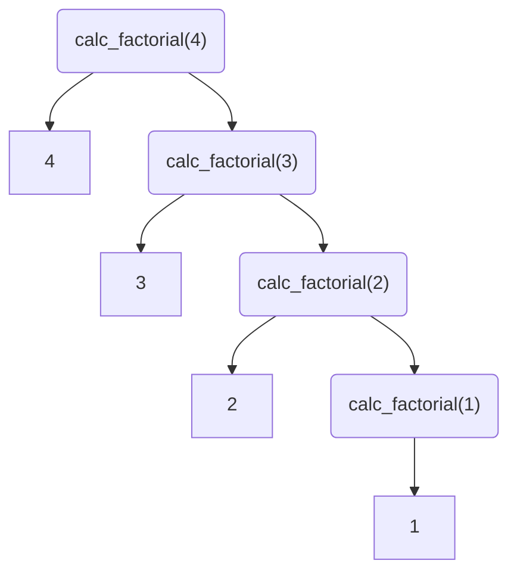

# Data structures

!!! note "Learning objectives"

    * Understand that data frames and tibbles are special lists
    * Know when and why to use a matrix
    * Understand attributes and how they affect data structure
    * Understand recursion in functions

<center>


</center>

All data objects are vectors. The difference between the colloquial vector (*atomic vector*) and list is the kinds of data they can contain: atomic vectors only store data of the same type in a single dimension (e.g., `c(1, 2, 3, 4, 5)`); lists are *generic vectors* that are able to store data of variable types and can also store other lists (i.e., *recursion*, see below). A further generalisation of the atomic vector are matrices (for 2-dimensional data) and arrays (for *n*-dimensions). While these types of data structures are seemingly restrictive (only one data mode allowed), they are how the vast majority of statistics and math is actually done!

## Tabular data

In Introduction to R, we introduced the data frame as a form tabular data storage. Here, we will extend that knowledge by exploring some of the underlying principles of tabular data structures in R. Additionally, we will also learn how to use them effectively.

### Data frames are special lists

Technically, *data frames are special lists*: they contain lists of variables of equal lengths (i.e., cases-by-variables). For practical purposes, think of each column as a vector, and that each vector has the same length that makes up the rows of the data frame. The following example exposes this construct:

!!! r-project "code"

    ```r linenums="1"
    nr <- 10
    df_list <- list(
      "A" = sample(asv$ASVID, nr),
      "B" = sample(asv[[sample(colnames(asv), 1)]], nr),
      "C" = sample(c(TRUE, FALSE), nr, replace = TRUE)
    )

    # Print data.frame
    as.data.frame(df_list)

    # Check equivalence and structure
    is.list(as.data.frame(df_list)) == is.list(df_list)

    str(as.data.frame(df_list))
    str(df_list)
    ```

!!! failure "`arguments imply differing number of rows`"

    If the number of elements of the vectors in the list is different, we will get the above error. This reinforces the special case of data frame as a list-based structure.

!!! info "Inspect source code of `data.frame`"

    If you look closely at the source code of the `data.frame` function, it exposes how the input is handled as a list and how it iteratively reconstructs the list into a tabular form, assigns column and row names, and performs checks on lengths.

If we wanted to, we can also add row names for coercion:

!!! r-project "code"

    ```r linenums="1"
    rn <- sample(words, nr)
    df_list <- map(df_list, \(x) {
      names(x) <- rn
      x
    })

    str(df_list)
    as.data.frame(df_list)
    ```

The list-based nature of the data frame means it is highly amenable to column-wise iteration via `map()` (or it's variants). However, due to the mixed data modes commonly found in data frames, the function being "mapped" will need to have some control flow statements to deal with them correctly.

!!! r-project "code"

    ```r linenums="1"
    # Shannon's index for each sample
    map(asv, \(x) {
      if (is.numeric(x)) {
        calc_alpha_diversity(x, index = "shannon")
      }
    }) %>%
      unlist()
    ```

### The lazy cousin: tibbles

Tibbles are a modern implementation of data frames developed and maintained by the folks behind tidyverse. We'll use an example to showcase how they are "lazy".

!!! r-project "code"

    Create a data frame and a tibble.

    ```r linenums="1"
    df_A <- data.frame(
      a = 1:3,
      b = I(matrix(rnorm(6), nrow = 3, ncol = 2)),
      c = I(list(
        matrix(rnorm(6), nrow = 3, ncol = 2),
        matrix(rnorm(6), nrow = 3, ncol = 2),
        as.data.frame(matrix(rnorm(6), nrow = 3, ncol = 2))
        )
      )
    )
    
    tbl_A <- tibble(
      a = 1:3,
      `245` = 3:5,
      `first letters` = letters[1:3],
      b = matrix(rnorm(6), nrow = 3, ncol = 2),
      c = list(
        matrix(rnorm(6), nrow = 3, ncol = 2),
        matrix(rnorm(6), nrow = 3, ncol = 2),
        as.data.frame(matrix(rnorm(6), nrow = 3, ncol = 2))
      )
    )
    ```

=== "Variables and their names are lazily evaluated"

    This means that variables are automatically interpreted "as is", meaning we can store non-atomic vectors within tibbles without extra effort (compare lines 3-9 to lines 14-19). Furthermore, column names with characters that are illegal in base R (i.e. with spaces) are returned as is. 

    !!! r-project "code"
    
        ```r linenums="1"
        tbl_A$`245`
        tbl_A$`first letters`
        ```

=== "Columns are built sequentially"

    Consider the following ways of obtaining the third column:

    !!! r-project "code"
    
        ```r linenums="1"
        # Construct data frame
        df_B <- data.frame(
          a = 1:5,
          b = 5:9
        )
        df_B$c <- df_B$a * df_B$b

        # Construct tibble
        tbl_B <- tibble(
          a = 1:5,
          b = 5:9,
          c = a * b
        )
        ```

    Both multiply columns `a` and `b` in the respective tables to obtain column `c`. However, notice how in `tibble()` this is done more naturally?

=== "Enhanced printing"

    !!! r-project "code"
    
        ```r linenums="1"
        print(asv)
        print(as_tibble(asv))
        print(as_tibble(asv), n = 15, width = 80)
        ```

    Cleaner and informative output of a printed tibble compared to the data frame. Moreover, we can control how many lines (`n`) and number of characters (`width`) we want to see.

=== "Strict subsetting"

    When using single bracket notation to subset a tibble, the result is always a tibble. This is not the case with data frames. Compare the outputs below:

    !!! r-project "code"
    
        ```r linenums="1"
        df_A[, 1] %>% str()
        tbl_A[, 1] %>% str()
        ```

!!! warning "Row names are not a thing in tibbles!"

### 2-dimensional superhero: Matrices

The matrix is another class of tabular data object. They are the 2-dimensional generalisation of an atomic vector, which makes them simpler and stricter structures compared to data frames or tibbles. We'll explore some of the properties of matrices, and then discuss a key advantage they have over data frames.

=== "Strict subsetting"

    When using square bracket notation for subsetting matrices, the result is always an atomic vector if there is only one row OR column, or a matrix if more then 1 row AND column is desired.

    !!! r-project "code"

        ```r linenums="1"
        str(env_matrix[, 2])
        str(env_matrix[2, ])
        str(env_matrix[1:5, 2:4])
        ```

    This property of strict subsetting and homogeneous data mode means that obtaining values from matrices is straight-forward and has predictable outputs. 

=== "Iterating on vector elements, not list of vectors"

    The atomic vector property of matrices means that iterations using `map()` is applied on each element. That is not the same as iterating on columns of a data frame. 

    !!! r-project "code"

        ```r linenums="1"
        map(env, length)
        map(env_matrix, length)
        ```

    Furthermore, the code above nicely illustrates that the total length of the data object. Line 1 gives the length of each column in a data frame, which is equivalent to the length of each vector in a list. Line 2 considers the length of each element of an atomic vector, hence the output is 1 repeated in a list of length 231, the latter of which is the number of elements in the matrix.

    !!! info "Use `apply()` to iterate correctly on a matrix"

        If iterating along the margins (AKA rows or columns) of the matrix is required, use the base R function `apply()` and specify the margin desired.

        !!! r-project "code"
        
            ```r linenums="1"
            # Iterating along rows
            apply(env_matrix, MARGIN = 1, length)
            # Iterating along columns
            apply(env_matrix, MARGIN = 2, length)
            ```

=== "Memory usage"

    For storing and processing large amounts of homogeneous data, matrix should be the go to data storage class. Compared to data frames (and tibbles), matrices are more compact (occupy less RAM).

    !!! r-project "code"

        ```r linenums="1"
        # Create data frame equivalent of asv_matrix
        asv_dataframe <- asv[, -1]
        rownames(asv_dataframe) <- asv$ASVID
        # Create tibble equivalent
        asv_tibble <- as_tibble(asv_dataframe, rownames = NA)

        map(
          mget(ls(pattern = "asv_.*), envir = .GlobalEnv),
          object.size
        )        
        ```

=== "Matrix operations"

    The atomic vector property of matrices also lends itself to powerful matrix operations. These are mathematical operations that work on entire matrices (recall vectorised functions), and they are the basis of much of the underlying statistical processes in R (e.g., matrix multiplication `%*%`, transposition `t()`, eigenvector `eigen()`, etc.). For most statistical analyses, such as calculating correlations `cor()`, covariance `cov()`, distances `dist()`, principle component analysis `princomp()` etc., the first thing that those functions do is coerce the input data into a matrix. Beyond R, entire branches of STEM rely on matrix operations to obtain numerical solutions to complex, high-dimensional problems (e.g., quantum physics, multiple sequence alignments, the color filter applied to your Instagram posts).

    Due to the fundamental nature of matrix operations, they are implemented at the C/C++ level (available in the [R source code](https://svn.r-project.org/R/branches/R-4-3-branch/src/) or it's [GitHub mirror](https://github.com/wch/r-source)). Higher level R functions (i.e., functions exposed to users) typically call those as soon as possible. This also means that users can exploit highly efficient and optimised algorithms packaged in Basic Linear Algebra Subprograms (BLAS) and Linear Algebra PACKage (LAPACK). Popular options include Intel's Math Kernel Library (optimised for Intel processors) and OpenBLAS. These software libraries provide substantial improvements in terms of computational efficiency, but are difficult to install for the average user (Thankfully, NeSI's R come pre-linked with BLAS and LAPACK libraries).

### Attributes

Think of attributes as metadata to the object. Some attributes determine the structure of the data so that R can interpret them properly, other attributes are attached as metadata or for the purposes of provenance. Every time we perform some action on an object, the object's class attribute will be examined prior to evaluation as some operations are restricted to certain classes. Besides `class()`, other basic attributes include `names()`, dimensions `dim()`, and dimension names `dimnames()`. In the context of matrices, `dim()` and `dimnames()` (list of row and column names, in that specific order) are important attributes that differentiates it from a 1-dimensional atomic vector. 

To extract and modify attributes:

!!! r-project "code"

    ```r linenums="1"
    # Create example data
    env_scaled <- scale(env_matrix)

    # Inspect attributes
    attributes(env_scaled)

    # Extract attributes
    attributes(env_scaled)$`scaled:scale`
    ```

As observed, calling `attributes()` returns a list object of the available attributes from which we can inspect. As it is a list, we can modify and add attributes by assigning it like a list-element.

!!! r-project "code"

    ```r linenums="1"
    attributes(env_scaled)$method <- "Z-score standardisation"

    # Inspect attributes
    attributes(env_scaled)
    ```

## Recursive objects: Functions

In the [Data Prelude lesson](https://genomicsaotearoa.github.io/Introduction-to-R/01-r-basics/#lists) of Introduction to R, we were introduced to the list class of data storage and how to manipulate them. Lists are an example of a recursive data object. That means that they can store other objects of different modes and classes, thus allowing for complex and hierarchical structures through nesting (think Russian dolls). To check if something is recursive, we can use the predicate function `is.recursive()`.

Something that may not be immediately intuitive is that functions are also recursive objects. In this context, recursion means something slightly different: a recursive function is a function that calls itself as part of it's source code/expression. For example, a factorial function applicable to integers:

$$
n! = \prod_{i=1}^{n} i
$$

!!! r-project "code"

    ```r linenums="1"
    calc_factorial <- function(n) {
      if (n > 1) {
        n * calc_factorial(n - 1)
      } else {
        1
      }
    }

    # Test that it works
    calc_factorial(4)
    prod(1, 2, 3, 4)
    ```

This function is the first time `calc_factorial()` is defined, but it calls itself in its expression! This is one of the examples of a recursive function. The recursive nature might be more easily understood as a diagram:



At the end of the diagram, we multiply all the tips (results) to get the solution.

## S3 and S4 objects

In R, objects obey different object-oriented programming systems (namely S3, S4, and R6) to define what the objects are. This primarily affects the object's class and how R interprets and processes the object. A large majority of the objects in R follow the S3 system.

The major difference between the two is that S4 is formally defined and stricter than S3. S4 is generally preferred when building large packages or suites of interacting packages with complex methods so that outputs and methods are consistent and that all code contributors have the same "vocabulary" for handling objects. This is the reason that all packages in Bioconductor are written using the S4 system in mind.

An additional item in S4 is slots, where slot values (think object property) are retrieved using package-specific accessor functions or the symbol `@`. The details that differentiates the systems are too detailed for the average R user and will not be covered here. For further reading, we refer you to the [Object-Oriented Programming section of Advanced R](https://adv-r.hadley.nz/oo.html)


<!--


Special cases of the atomic vector are the matrix and array. The latter two all have one commonality: attributes `dim` and `dimnames`. A matrix is a special 2-dimensional case of an atomic vector (`dim(matrix) == 2`), whereas an array is a multi-dimensional (`dim(array) > 1`). As for `dimnames`, think of them as column and row names for matrices (for arrays, they are just the names of each dimension).

!!! note "Attributes"

    

Tibble is the only one out of the diagram that is not part of `base` R. It is implemented via the `tibble` package and is the primary way the `tidyverse` stores tabular data. It is similar to a data frame with some key differences:

* Variables and their names are lazily evaluated (more on this soon)
* Columns are built sequentially
* Enhanced printing

We will be exploring how to use tibbles and compare it to a data frame in the subsections below.

## Matrix versus data frame, and why the choice matters

While it seems that both matrices and data frames are similar in that they represent data in 2-dimensional structures, there are marked distinctions in how R interprets them. We will prepare an example based on a subset of `asv` to illustrate these differences.

### Structure

!!! r-project "code"

    ```r
    # Example data uses the first 5 numeric columns and rows of asv
    # The ASVID is designated as the row name
    num_df <- data.frame(asv[1:5, 2:6], row.names = asv[1:5, 1])
    num_mt <- as.matrix(num_df)
    ```

    === "Printing"

        ```r
        print(num_df)
        print(num_mt)
        ```

        > ```
        >                                  AS1A1 AS1A2 AS1A3 AS1B1 AS1B2
        > 88c2f5ea8fd2f13cbd43e933049707c9    45    22    37    50    55
        > bab6b4a509dd01b93cbbf78e40616533    81    48    79    96    87
        > 24b484137e882a5c77ea93b4574332e1    70    16    53    86    55
        > 5d112573567f99604339d5d6b92bdea9    35    14    26    63    45
        > 864ea29bffe398510cca601c0ce546c2    61    32    37    72    75
        > ```

        > ```
        >                                  AS1A1 AS1A2 AS1A3 AS1B1 AS1B2
        > 88c2f5ea8fd2f13cbd43e933049707c9    45    22    37    50    55
        > bab6b4a509dd01b93cbbf78e40616533    81    48    79    96    87
        > 24b484137e882a5c77ea93b4574332e1    70    16    53    86    55
        > 5d112573567f99604339d5d6b92bdea9    35    14    26    63    45
        > 864ea29bffe398510cca601c0ce546c2    61    32    37    72    75
        > ```

    === "Structure"

        ```r
        str(num_df)
        str(num_mt)
        ```

        > ```
        > 'data.frame':	5 obs. of  5 variables:
        >  $ AS1A1: int  45 81 70 35 61
        >  $ AS1A2: int  22 48 16 14 32
        >  $ AS1A3: int  37 79 53 26 37
        >  $ AS1B1: int  50 96 86 63 72
        >  $ AS1B2: int  55 87 55 45 75
        > ```

        > ```
        >  int [1:5, 1:5] 45 81 70 35 61 22 48 16 14 32 ...
        >  - attr(*, "dimnames")=List of 2
        >   ..$ : chr [1:5] "88c2f5ea8fd2f13cbd43e933049707c9" "bab6b4a509dd01b93cbbf78e40616533" "24b484137e882a5c77ea93b4574332e1" "5d112573567f99604339d5d6b92bdea9" ...
        >   ..$ : chr [1:5] "AS1A1" "AS1A2" "AS1A3" "AS1B1" ...
        > ```

    === "Class"

        ```r
        class(num_df)
        class(num_mt)
        ```

        > ```
        > [1] "data.frame"
        > ```

        > ```
        > [1] "matrix" "array"
        > ```

    === "Attributes"

        ```r
        attributes(num_df)
        attributes(num_mt)
        ```

        > ```
        > $names
        > [1] "AS1A1" "AS1A2" "AS1A3" "AS1B1" "AS1B2"
        > 
        > $class
        > [1] "data.frame"
        > 
        > $row.names
        > [1] "88c2f5ea8fd2f13cbd43e933049707c9" "bab6b4a509dd01b93cbbf78e40616533" "24b484137e882a5c77ea93b4574332e1"
        > [4] "5d112573567f99604339d5d6b92bdea9" "864ea29bffe398510cca601c0ce546c2"
        > ```

        > ```
        > $dim
        > [1] 5 5
        > 
        > $dimnames
        > $dimnames[[1]]
        > [1] "88c2f5ea8fd2f13cbd43e933049707c9" "bab6b4a509dd01b93cbbf78e40616533" "24b484137e882a5c77ea93b4574332e1"
        > [4] "5d112573567f99604339d5d6b92bdea9" "864ea29bffe398510cca601c0ce546c2"
        > 
        > $dimnames[[2]]
        > [1] "AS1A1" "AS1A2" "AS1A3" "AS1B1" "AS1B2"
        > ```

    === "Size"

        ```r
        length(num_df)
        nrow(num_df)
        ncol(num_df)

        length(num_mt)
        nrow(num_mt)
        ncol(num_mt)
        ```

        > ```
        > [1] 5
        > [1] 5
        > [1] 5
        > ```

        > ```
        > [1] 25
        > [1] 5
        > [1] 5
        > ```

    === "Iteration"

        ```r
        map_lgl(num_df, is.numeric)
        map_lgl(num_mt, is.numeric)
        ```

        > ```
        > AS1A1 AS1A2 AS1A3 AS1B1 AS1B2 
        >  TRUE  TRUE  TRUE  TRUE  TRUE
        > ```

        > ```
        >  [1] TRUE TRUE TRUE TRUE TRUE TRUE TRUE TRUE TRUE TRUE TRUE TRUE TRUE TRUE TRUE TRUE TRUE TRUE TRUE TRUE TRUE
        > [22] TRUE TRUE TRUE TRUE
        > ```

When printing, there are no differences between data frames and matrices. However, when we inspect the underlying structure, attributes, size, and iteration output of the objects we find that R interprets them very differently. Perhaps the most convincing observation that data frames are special cases of a list is that when we iterate using `map_lgl()`, the outputs match the number of columns with the column names printed. However, when it was used on the matrix, it returns a Boolean logical with the same length as `nrow(num_mt) * ncol(num_mt)`.

!!! note "Operations"

    Another distinction of matrices and data frames is the operations we can do with them. There are many applications in numerical and statistical analyses that require matrix-based operations: 

    * Addition 
    * Subtraction 
    * Scalar multiplication
    * Transposition
    * Matrix multiplication.

    Of the 5 operations, matrix multiplication only works with matrices; the other operations will work if the input is a numeric data frame, whereas transposition will also produce a valid object but if there are any data types that are not numeric, the entire data frame will be coerced into character variables.

## Tibbles as flexible data storage

Tibbles are lazy data frames. We'll try to describe what this implies for the points mentioned above:

!!! r-project "code"

    ```r linenums="1"
    df_A <- data.frame(
      a = 1:3,
      b = I(matrix(rnorm(6), nrow = 3, ncol = 2)),
      c = I(list(
        matrix(rnorm(6), nrow = 3, ncol = 2),
        matrix(rnorm(6), nrow = 3, ncol = 2),
        as.data.frame(matrix(rnorm(6), nrow = 3, ncol = 2))
        )
      )
    )
    
    tbl_A <- tibble(
      a = 1:3,
      `245` = 3:5,
      `first letters` = letters[1:3],
      b = matrix(rnorm(6), nrow = 3, ncol = 2),
      c = list(
        matrix(rnorm(6), nrow = 3, ncol = 2),
        matrix(rnorm(6), nrow = 3, ncol = 2),
        as.data.frame(matrix(rnorm(6), nrow = 3, ncol = 2))
      )
    )
    ```

    === "Variables and their names are lazily evaluated"

        This means that variables are not coerced into another data type as is commonly done in data frames (characters are often converted to factors). Also, we can store non-atomic vectors within tibbles without extra effort (compare lines 3-9 to lines 14-19). Furthermore, column names with characters that are illegal in base R (i.e. with spaces) are returned as is. 

        ```r    
        tbl_A$`245`
        tbl_A$`first letters`
        ```

        ```
        [1] 3 4 5
        [1] "a" "b" "c"
        ```

    === "Columns are built sequentially"

        Consider the following ways of obtaining the third column:

        ```r
        # Construct data frame
        df_B <- data.frame(
          a = 1:5,
          b = 5:9
        )
        df_B$c <- df_B$a * df_B$b
        # Construct tibble
        tbl_B <- tibble(
          a = 1:5,
          b = 5:9,
          c = a * b
        )
        ```

        Both multiply columns `a` and `b` in the respective tables to obtain column `c`. However, notice how in `tibble()` this is done more naturally?

    === "Enhanced printing"

        ```r
        print(asv)
        print(as_tibble(asv))
        print(as_tibble(asv), n = 15, width = 80)
        ```

        Notice the cleaner and informative output of a printed tibble compared to the data frame. Moreover, we can control how many lines (`n`) and number of characters (`width`) we want to see.

-->

