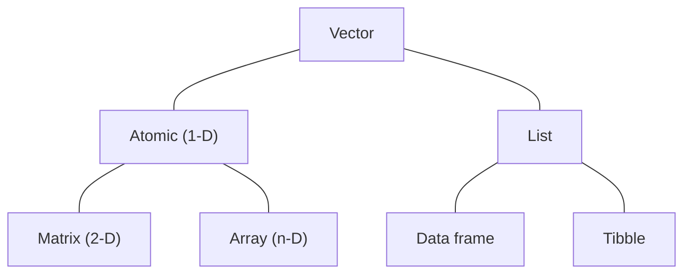

# Data structures

!!! note "Learning objectives"

    * Understand nuances in different data structures in R
    * Understand attributes and how it affects data structures
    * Use tibbles for data storage

## Brief overview of data structures



The chart above summarises the common data structures available in R. Technically, all data objects are vectors. The difference between the colloquial vector (*atomic vector*) and list is their nature: atomic vectors only store data of the same type in a single dimension (e.g., `c(1, 2, 3, 4, 5)`); lists are *generic vectors* that are able to store data of variable types and can also store other lists (i.e., *recursive*). 

In Introduction to R, we introduced the data frame as a form tabular data storage. Technically, *data frames are special lists*: they contain lists of variables of equal lengths (i.e., cases-by-variables). For practical purposes, think of each column as a vector, and that every vector has the same length that makes up the rows of the data frame.

Special cases of the atomic vector are the matrix and array. The latter two all have one commonality: attributes `dim` and `dimnames`. A matrix is a special 2-dimensional case of an atomic vector (`dim(matrix) == 2`), whereas an array is a multi-dimensional (`dim(array) > 1`). As for `dimnames`, think of them as column and row names for matrices (for arrays, they are just the names of each dimension).

Tibble is the only one out of the diagram that is not part of `base` R. It is implemented via the `tibble` package and is the primary way the `tidyverse` stores tabular data. It is similar to a data frame with some key differences:

* Variables and their names are lazily evaluated
* Columns are built sequentially
* Enhanced printing

We will be exploring how to use tibbles and compare it to a data frame in the subsections below.

!!! note "Attributes"

    Think of attributes as 

## Matrix versus data frame, and why the choice matters

While it seems that both matrices and data frames are similar in that they represent data in 2-dimensional structures, there are marked distinctions in how R interprets them. We will prepare a example based on a subset of `asv` to illustrate these differences.

### Structure

!!! r-project "code"

    ```r
    # Example data uses the first 5 numeric columns and rows of asv
    # The ASVID is designated as the row name
    num_df <- data.frame(asv[1:5, 2:6], row.names = asv[1:5, 1])
    num_mt <- as.matrix(num_df)
    ```

    === "Printing"

        ```r
        print(num_df)
        print(num_mt)
        ```

        > ```
        >                                  AS1A1 AS1A2 AS1A3 AS1B1 AS1B2
        > 88c2f5ea8fd2f13cbd43e933049707c9    45    22    37    50    55
        > bab6b4a509dd01b93cbbf78e40616533    81    48    79    96    87
        > 24b484137e882a5c77ea93b4574332e1    70    16    53    86    55
        > 5d112573567f99604339d5d6b92bdea9    35    14    26    63    45
        > 864ea29bffe398510cca601c0ce546c2    61    32    37    72    75
        > ```

        > ```
        >                                  AS1A1 AS1A2 AS1A3 AS1B1 AS1B2
        > 88c2f5ea8fd2f13cbd43e933049707c9    45    22    37    50    55
        > bab6b4a509dd01b93cbbf78e40616533    81    48    79    96    87
        > 24b484137e882a5c77ea93b4574332e1    70    16    53    86    55
        > 5d112573567f99604339d5d6b92bdea9    35    14    26    63    45
        > 864ea29bffe398510cca601c0ce546c2    61    32    37    72    75
        > ```

    === "Structure"

        ```r
        str(num_df)
        str(num_mt)
        ```

        > ```
        > 'data.frame':	5 obs. of  5 variables:
        >  $ AS1A1: int  45 81 70 35 61
        >  $ AS1A2: int  22 48 16 14 32
        >  $ AS1A3: int  37 79 53 26 37
        >  $ AS1B1: int  50 96 86 63 72
        >  $ AS1B2: int  55 87 55 45 75
        > ```

        > ```
        >  int [1:5, 1:5] 45 81 70 35 61 22 48 16 14 32 ...
        >  - attr(*, "dimnames")=List of 2
        >   ..$ : chr [1:5] "88c2f5ea8fd2f13cbd43e933049707c9" "bab6b4a509dd01b93cbbf78e40616533" "24b484137e882a5c77ea93b4574332e1" "5d112573567f99604339d5d6b92bdea9" ...
        >   ..$ : chr [1:5] "AS1A1" "AS1A2" "AS1A3" "AS1B1" ...
        > ```

    === "Class"

        ```r
        class(num_df)
        class(num_mt)
        ```

        > ```
        > [1] "data.frame"
        > ```

        > ```
        > [1] "matrix" "array"
        > ```

    === "Attributes"

        ```r
        attributes(num_df)
        attributes(num_mt)
        ```

        > ```
        > $names
        > [1] "AS1A1" "AS1A2" "AS1A3" "AS1B1" "AS1B2"
        > 
        > $class
        > [1] "data.frame"
        > 
        > $row.names
        > [1] "88c2f5ea8fd2f13cbd43e933049707c9" "bab6b4a509dd01b93cbbf78e40616533" "24b484137e882a5c77ea93b4574332e1"
        > [4] "5d112573567f99604339d5d6b92bdea9" "864ea29bffe398510cca601c0ce546c2"
        > ```

        > ```
        > $dim
        > [1] 5 5
        > 
        > $dimnames
        > $dimnames[[1]]
        > [1] "88c2f5ea8fd2f13cbd43e933049707c9" "bab6b4a509dd01b93cbbf78e40616533" "24b484137e882a5c77ea93b4574332e1"
        > [4] "5d112573567f99604339d5d6b92bdea9" "864ea29bffe398510cca601c0ce546c2"
        > 
        > $dimnames[[2]]
        > [1] "AS1A1" "AS1A2" "AS1A3" "AS1B1" "AS1B2"
        > ```

    === "Size"

        ```r
        length(num_df)
        nrow(num_df)
        ncol(num_df)

        length(num_mt)
        nrow(num_df)
        ncol(num_df)
        ```

        > ```
        > [1] 5
        > [1] 5
        > [1] 5
        > ```

        > ```
        > [1] 25
        > [1] 5
        > [1] 5
        > ```

    === "Iteration"

        ```r
        map_lgl(num_df, is.numeric)
        map_lgl(num_mt, is.numeric)
        ```

        > ```
        > AS1A1 AS1A2 AS1A3 AS1B1 AS1B2 
        >  TRUE  TRUE  TRUE  TRUE  TRUE
        > ```

        > ```
        >  [1] TRUE TRUE TRUE TRUE TRUE TRUE TRUE TRUE TRUE TRUE TRUE TRUE TRUE TRUE TRUE TRUE TRUE TRUE TRUE TRUE TRUE
        > [22] TRUE TRUE TRUE TRUE
        > ```

On printing, there are no differences between data frames and matrices. However, when we inspect the underlying structure, attributes, size, and iteration output of the objects, we find that R interprets them very differently. Perhaps the most convincing observation that data frames are special cases of a list is that when we iterate using `map_lgl()`, the outputs match the number of columns with the column names printed. However, when it was used on the matrix, it returns a Boolean logical with the same length as `nrow(num_mt) * ncol(num_mt)`.

### Data processing

* There is

### Data frames, matrices, and... tibbles?

Until now, we have encountered 2 kinds of tabular (or 2-dimensional) data: 

* Data frames (used here and in Introduction to R)
* Matrices  (used here to make our heatmaps)
 
Here, we will use another kind of tabular data storage method: tibbles. However, before introducing the tibble, we should ask ourselves: What is the difference between a `data.frame` and a `matrix`?Recall that data frames are a special kind of list, where each column is a variable containing one type of data and all variables in this list have the same number of elements. In addition, different columns in the data frame can be of a different data type. You can check this with the `asv` or `taxa` data that we loaded. I'm using `taxa` here for brevity of output.

```r
# Check that taxa is a data frame
is.data.frame(taxa)
# Check that columns can be of different data types
map(taxa, mode)
```

```
[1] TRUE

$Feature_ID
[1] "character"

$Taxon
[1] "character"

$Confidence
[1] "numeric"
```

If you are familiar with checking data in R, you know we could have also used `str()` to determine each column's data type. Here, I used `map(asv, mode)` to show that it is a special case of list, where it naturally iterates through each column as if iterating through vectors stored in a list.

What about a matrix? It is also a 2-dimensional data structure, so what is different about it? Well, matrices are special cases of vectors. Remember that all elements in a vector must have the same data type? This is true of matrices. Matrices always have a `dim` (read dimension) attribute of 2. They can also have `dimnames` (read `row.names` and `col.names`). To illustrate this, let's use `asv`.

```r
# Check data type for entire table
str(as.matrix(asv))
```

```
chr [1:4031, 1:22] "88c2f5ea8fd2f13cbd43e933049707c9" "bab6b4a509dd01b93cbbf78e40616533" ...
 - attr(*, "dimnames")=List of 2
  ..$ : NULL
  ..$ : chr [1:22] "ASVID" "AS1A1" "AS1A2" "AS1A3" ...
```

That's quite an unusual result, but let's see what is going on line by line:

1. Note that the first line of the output shows that it is a `chr` mode of data. The ranges within `[]` show that we have 4031 indices in dimension 1 (rows) and 22 indices in dimension 2 (columns). It also outputs the first few elements, which are the ASVIDs.
2. It is also telling us there is an attribute (`attr`) called `"dimnames"` which is a list of 2 vectors:
   1. a `NULL` vector (we do not have row names, hence `NULL`)
   2. a character vector with 22 elements (these are our column names)

You might ask: why is it a character matrix? By default, if R encounters mixed data types, it will attempt to coerce everything as characters. We have encountered the function `column_to_rownames()` above, let's use that to turn the `ASVID` column into row names, coerce the data into a matrix, and then check the data using `str()`.

```r
column_to_rownames(asv, "ASVID") %>% 
  as.matrix() %>% 
  str()
```

```
 num [1:4031, 1:21] 45 81 70 35 61 25 16 43 26 32 ...
 - attr(*, "dimnames")=List of 2
  ..$ : chr [1:4031] "88c2f5ea8fd2f13cbd43e933049707c9" "bab6b4a509dd01b93cbbf78e40616533" "24b484137e882a5c77ea93b4574332e1" "5d112573567f99604339d5d6b92bdea9" ...
  ..$ : chr [1:21] "AS1A1" "AS1A2" "AS1A3" "AS1B1" ...
```

That's a subtly different output. We see that it is now numeric with 4031 and 21 indices in dimensions 1 and 2, respectively. There are also row names which are our ASVIDs and column names.

Okay, now you know what data frames and matrices really are, what has that got to do with tibbles? This is about flexibility. Notice that with data frames and matrices, you are really limited by what kind of data you can store: atomic data types. What if you have analyses that require the output of lists and arrays? Perhaps you are transforming the data multiple times and need to save the intermediate results for alternative analyses, are you going to crowd your `.GlobalEnv`? Recursively and iteratively create more nested lists like Matryoshka dolls? This is where tibbles come in.

Tibbles are an evolution of data frames, but instead of being smarter at guessing data, they're lazier. They are lazy because they:

!!! note

    === "Do not enforce data types"

        Think of this like digital shelves. You can store whole vectors, lists, arrays/matrices, even data frames within each cell!
  
    === "Do not adjust variable names (think column names)"

        Have you ever had comma- or tab-delimited files where headers are named with spaces like below?

        ```
        Sample    Salinity    Mud content    Organic carbon
        ```

        These will inevitably trigger either a warning, or depending on the characters used, even an error when importing data. If imported as a tibble, R will not complain, and you can refer to each column by surrounding it with backticks, like so:

        ```r
        tbl$`Mud content`
        ```

    === "Lazily and sequentially evaluate arguments"

        This is a unique feature of tibbles that makes it easy to create and populate tabular data, especially if there are dependencies between variables. Consider this:

        We want to create a table where column A is a vector of integers, and column 2 is a calculation dependant on column B.

        If we were to create this using `data.frame()`, the code will look like this:

        ```r
        # Create data frame with column A
        df <- data.frame(
          A = rpois(10, 4)
        )
        # Create column B in data frame using values from column A as the mean
        df$B <- rnorm(n = nrow(df), mean = df$A)

        df
        ```

        ```
           A        B
        1  5 5.613719
        2  7 6.700890
        3  3 1.993785
        4  4 4.312433
        5  3 3.292354
        6  2 3.489764
        7  3 4.938117
        8  5 5.246944
        9  4 5.747918
        10 5 4.207845
        ```

        Now let's look at how to create a similar table using `tibble()`:

        ```r
        tb <- tibble(
          A = rpois(10, 4),
          B = rnorm(n = length(A), mean = A)
        )

        tb
        ```

        ```
        # A tibble: 10 × 2
               A     B
           <int> <dbl>
         1     7  8.37
         2     4  4.06
         3     6  6.78
         4     1  1.02
         5     3  1.42
         6     7  5.89
         7     3  1.69
         8     2  2.53
         9     6  5.33
        10     3  4.01
        ```

        Notice how much cleaner (and less typing) that was? It evaluates every argument based on whether if something was created in the lines before it.

One other thing you may notice is how data is printed. The example above prints `df` and `tb`, but the unique printed output of tibbles becomes really useful when looking at larger tables. Compare the following:

```r
as.data.frame(asv)
as_tibble(asv)
```

Notice that with `as.data.frame(asv)` the printed output is quite voluminous and it ends with a `[ reached 'max' / getOption("max.print") -- omitted 3986 rows ]` warning. However, with `as_tibble(asv)`, the result is cleaner and more informative. It's like `str()`, but tabular.

Tibbles are an essential part of how data is stored in the `tidy` framework. When importing data using functions from the `readr` package, most of the time, the resulting data object will be a tibble. Personally, I find tibbles to be highly useful when doing interactive work (e.g., analyses where I have to supervise intermediate outputs, plotting and comparing multiple outputs). Once I know what outputs I want and the code I will use *en masse*, I will often write a new script that does just that to streamline the process. That way, I have a script that describes my exploratory process (usually tibbles involved) and another that is written to produce a certain outcome (usually matrices involved).