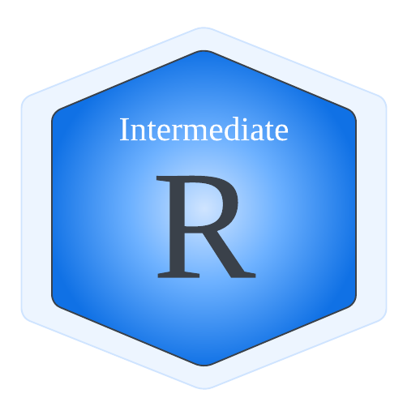

# {width="300"}

## Preamble

!!! circle-info "In this workshop, we will be learning a few techniques to achieve the following goals:"

    * Write fewer lines of code
    * Scale analyses
    * Understand how to put multiple concepts together
    * Make code predictable and readable.

!!! bookmark "The topics we will cover here are:"

    [1. Managing and manipulating relational data](./1.relational_data.md) 
    [2. Manipulating strings](./2.string_manipulation.md) 
    [3. Writing functions](./3.function_conditions.md) 
    [4. Using iterations](./4.iterations.md) 
    [5. Understanding data structures](./5.data_structures.md) 

!!! info ""

Although the lessons are structured in a modular fashion, these techniques complement each other in order to help us achieve the goals above.

!!! info ""

## Pre-requisites

!!! check-to-slot "To fully engage with the material in this workshop, you will need:"

    * [X] An [introductory knowledge of R](https://genomicsaotearoa.github.io/Introduction-to-R/)

          * Variable assignment
          * Mathematical and Boolean operators
          * Data modes
          * Importing data
          
    * [X] Some familiarity with the `tidyverse` dialect of R code as shown [here](https://genomicsaotearoa.github.io/Introduction-to-R/appendix/05-dplyr/):
          * `mutate()` and `filter()`
          * `group_by()` and `summarise()`
          * `%>%`
    * [X] [Familiarity with lists](https://genomicsaotearoa.github.io/Introduction-to-R/01-r-basics/#lists)