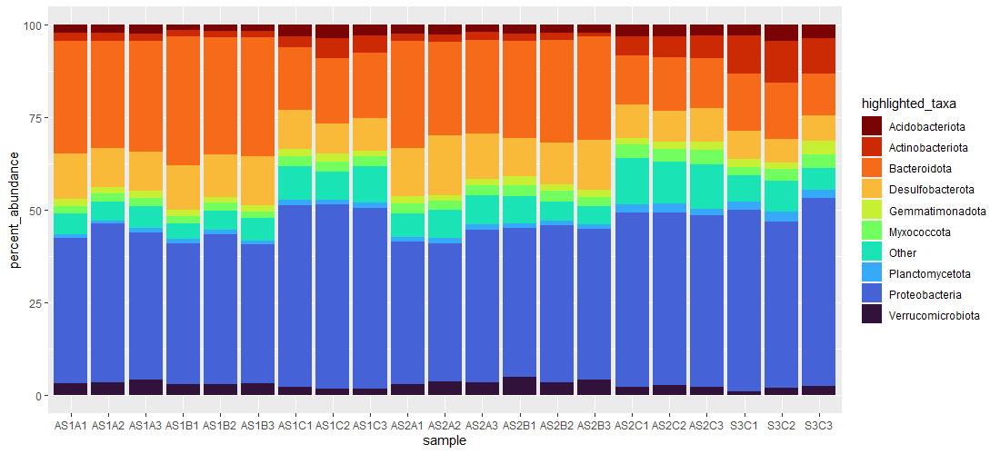
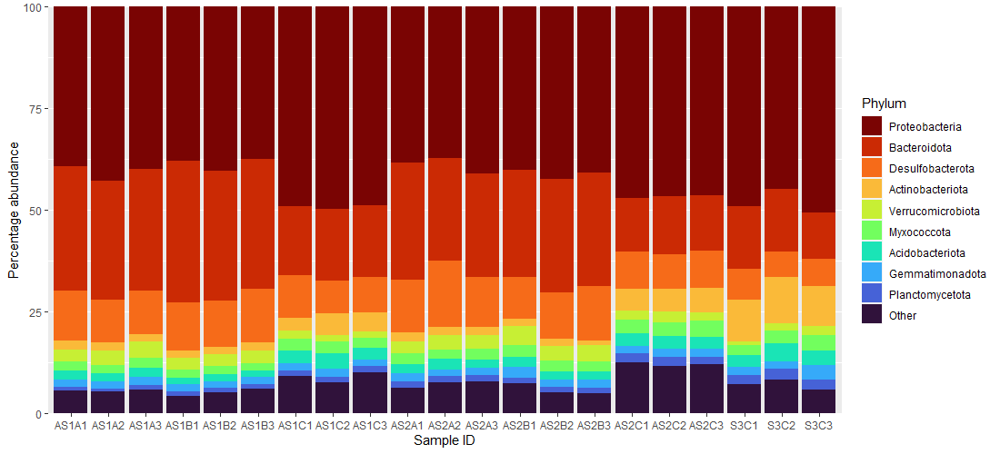

# Code in action: Taxonomic bar plot

<!--
Requires:

* left_join()
* str_replace()
* if_else()
* summarise(across())

Might want to move this to after functions and conditional statements
-->

Previously, we looked at joining tables and string-based operations. We will put those concepts to use and create a taxonomic bar plot. After obtaining sequence data and having completed sequence-based analyses, this is often the next step in exploratory data analysis in microbial ecology. This figure should have the following features:

**Highlights highly abundant and prevalent taxa**

This is a rather vague and loaded statement. What constitutes *highly abundant* is arbitrary. Is an average abundance of 10% high enough? Is 1-5% too low? If and how do we group the average? The same can be said of *prevalent*. Should taxa be in 30%, 50%, 75%, 80% of all/grouped samples to be considered *prevalent*? Notice also the use of the word *taxa*. Do we show the abundance of ASVs (bear in mind we have over 4000 of them in this data)? It is common to find figures like these to be presented based on aggregated data (i.e., the sum of ASV abundance assigned to a particular lineage at some taxonomic level). Often, the data is aggregated at the phylum level as taxonomic assignments at lower levels can be sparse. In practice, this is an exercise in balancing information volume and visual aesthetics. On one hand, we want to present sufficient information about the distribution of organisms. On the other hand, we want to avoid visual clutter so as to not overwhelm the viewer.

<!--
For this example, we will:

* Aggregate the data at the *phylum* level
* Consider phyla that contribute to *at least 1%* of the total community to be highly abundant
* Consider phyla that are present in *at least 50%* of the samples to be prevalent
-->

**Shows *relative* abundance**

The `asv` table is technically *relative* abundance of the sampled microbial community ([Gloor et al, 2017](https://doi.org/10.3389/fmicb.2017.02224)). However, presenting this data, aggregated or not, in the count scale requires mental arithmetic on the viewer's part to convert them how taxa are abundant *relative* to each. It is more intuitive to present this as a percentage to show how this relationship between taxa. Therefore, after aggregation, we will convert the counts into percentage data.

## Step 1: Join data

The very first thing that we need to do is combine `asv` and `tax` table. However, note that we do not require the `Confidence` column in `tax`, so we will remove it via a negative `select()`. We will also `mutate()` a column containing the `phylum` assignments, if there are any.

!!! r-project "code"

    ```r linenums="1"
    asv_tax <- left_join(asv, tax, by = c("ASVID" = "Feature_ID")) %>% 
      select(-Confidence) %>% 
      mutate(
        phylum = str_replace(Taxon, ".+p__([^;]+).*", "\\1")
      )
    ```

Recall from the string manipulation lesson that there are many ways to extract a sub-string. In line 4, we are using `str_replace()` to extract a sub-string by substituting the whole string using a captured pattern. 

## Step 2: Aggregate data

Here, we will create a `sum` of ASV abundances via `summarise(across())` grouped by their assigned `phylum` using `group_by()`. Following that, we convert the numeric data from count to percentages to show relative abundance in a more intuitive manner.

!!! r-project "code"

    ```r linenums="1"
    asv_tax_prop <- asv_tax %>% 
      group_by(phylum) %>% 
      summarise(
        across(where(is.numeric), sum)
      ) %>% 
      mutate(
        across(where(is.numeric), function(x) x * 100 / sum(x))
      )
    ```

!!! note "Code breakdown: `summarise(across(where(<predicate>), <function>))`"

    This is a very convenient utility of the `tidyverse` dialect. We can read the code as saying (in plain English):

    > `summarise()` the data `across()` the columns `where()` it satisfies the predicate (a function that returns one TRUE/FALSE) using the provided `<function>`.

    In line 4, we are using this syntax to create sums of ASV abundances (where the data is numeric) that were previously grouped by their phylum assignments.

    `across()` works for most column-based operations (as exemplified by `mutate()` above) within the `tidyverse` framework.

    In line 7, we use it to convert the sums into percentages via an anonymous function.

## Step 3: Highlight thresholds 

Recall that we need to set thresholds for average abundance and prevalence to show distribution of taxa. Lets explore what thresholds we should apply in order for a phylum to be highlighted in the figure.

!!! r-project "code"

    ```r linenums="1"
    # Average phylum relative abundance across all samples
    ave_phy_abd <- rowMeans(asv_tax_prop[, -1]) %>% 
      set_names(asv_tax_prop$phylum)

    # Convert phylum relative abundance to presence-absence to determine prevalence 
    pa_phy_abd <- asv_tax_prop %>% 
      mutate(
        across(where(is.numeric), ~ if_else(.x > 0, 1, 0))
      )

    # Phylum prevalence
    prev_phy <- rowSums(pa_phy_abd[, -1]) %>% 
      set_names(pa_phy_abd$phylum)

    # Combined average relative abundance and prevalence data
    abd_prv <- data.frame(
      "phylum" = names(ave_phy_abd),
      "average_relative_abundance" = ave_phy_abd,
      "prevalence" = prev_phy
    )
    ```

Examine the combined object in the viewing panel and sort your data by abundance by clicking on the column header. We observe that most phyla are prevalent across our samples, where more than half of the taxa recovered were present in more than half of the samples (26 phyla found in more than 10 samples). However, only a small number of phyla were contributing to an average relative abundance of more than 1% (9 out of 34 phyla). Furthermore, phyla that contributed to > 1% average relative abundance across all samples were also found in all samples, suggesting that these are *highly abundant* and *prevalent*.

We will now filter `abd_prv` to create data that we can use to conditionally mutate `asv_tax_prop`.

!!! r-project "code"

    ```r
    abd_prv_filt <- filter(abd_prv, average_relative_abundance > 1)
    ```

## Step 4: Apply thresholds

In the code below, we apply the thresholds found in the last line in [**Step 3**](#step-3-highlight-thresholds) to pick which phylum we would like to highlight in the figure. We also convert the "wide" format data into a "long" format.

!!! r-project "code"

    ```r linenums="1"
    asv_tax_prop <- asv_tax_prop %>% 
      mutate(
        highlighted_taxa = if_else(phylum %in% abd_prv_filt$phylum, phylum, "Other")
      )

    asv_tax_prop_long <- pivot_longer(
      asv_tax_prop, 
      where(is.numeric), 
      names_to = "sample", 
      values_to = "percent_abundance"
    )
    ```

In lines 6&ndash;11, we are pivoting the data such that numeric columns become a single column as `percent_abundance` and the headers for those numeric columns become values in the `sample` column. This becomes the data frame from which `ggplot()` will use as the basis for the plot.

## Step 5: Initial plot

With all the components ready, we can plot our data!

!!! r-project "code"

    ```r linenums="1"
    ggplot(asv_tax_prop_long, aes(x = sample, y = percent_abundance)) +
      geom_col(aes(fill = highlighted_taxa)) +
      scale_fill_viridis_d(direction = -1, option = "H")
    ```

    

We are moving in the right direction! The data is what we intend the plot to show: abundant and prevalent taxa across samples. We also made sure to use a sensible colour fill (`scale_fill_viridis_d(direction = -1, option = "H")`)

However, we can refine the plot further:

* Labels should be proper sentence case
* Phyla should be ordered in some way
* There should be no gaps on the vertical axis

## Step 6: Refine plot

!!! r-project "code"

    ```r linenums="1"
    # Create factor variable to enforce ordering
    phylum_factor <- abd_prv_filt %>%
      arrange(-average_relative_abundance) %>% 
      pull(phylum)

    # Remember to add "Other" as part of the factor!
    phylum_factor <- c(phylum_factor, "Other")

    # Refine plot
    ggplot(asv_tax_prop_long, aes(x = sample, y = percent_abundance)) +
      # Enforce factor ordering in the plot code
      geom_col(aes(fill = factor(highlighted_taxa, levels = phylum_factor))) + 
      # Add labels
      labs(x = "Sample ID", y = "Percentage abundance", fill = "Phylum") +
      # Remove marginal spaces on vertical axis
      scale_y_continuous(expand = c(0, 0)) +
      scale_fill_viridis_d(direction = -1, option = "H")
    ```

    

!!! note "Modulating scales in `ggplot2`"

    There are many occasions where you might want to set limits, control the marginal spacing (line 16, above), manually set breaks, etc. along either the horizontal or vertical axis. You can control a variety of these options via `scale_<axis>_<data type>` where <axis> can be `x` (horizontal) or `y` (vertical), and <data type> can be `continuous`, `discrete` (for factor-like axis), `date`, `time`, etc. Definitely take a look at help pages for these functions to learn how they work.
